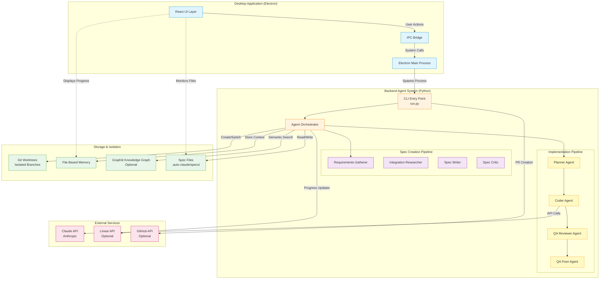
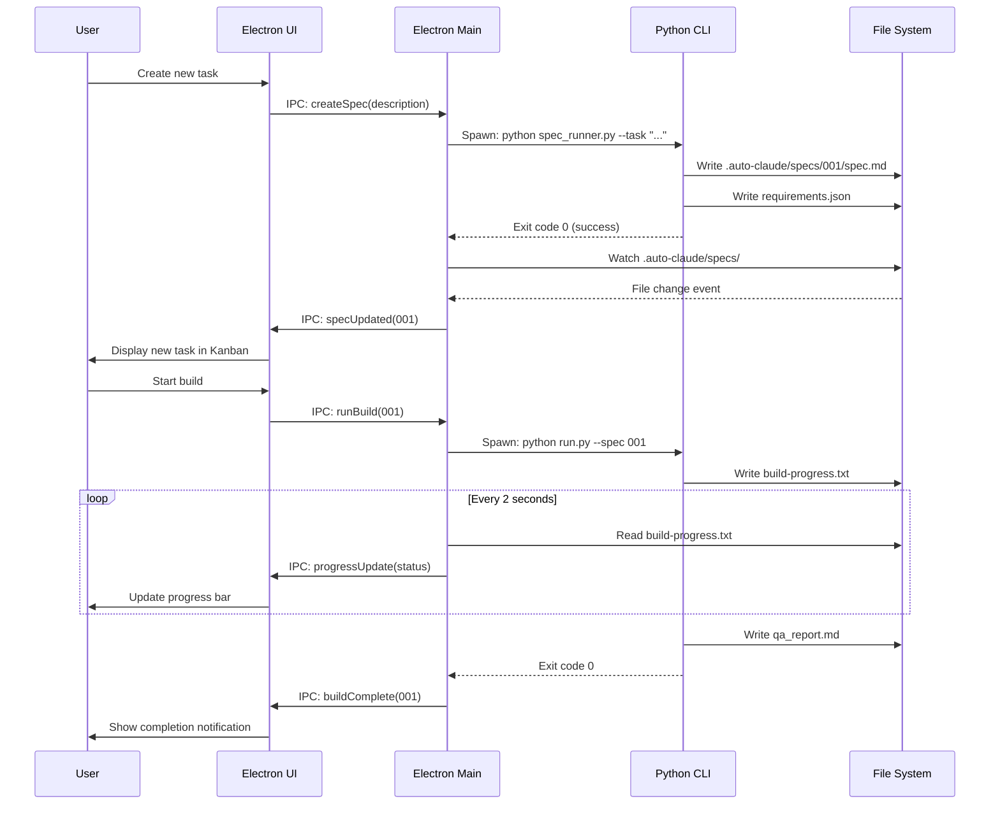
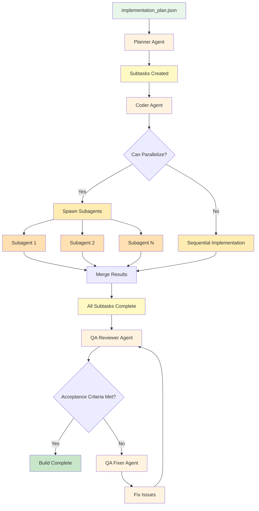
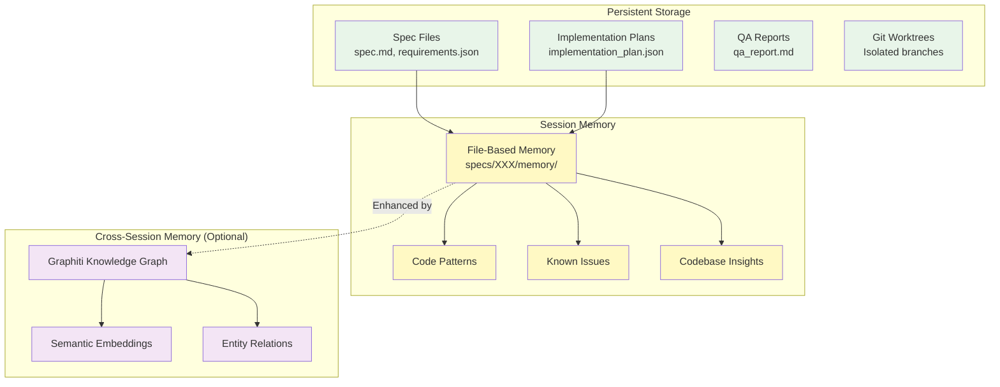
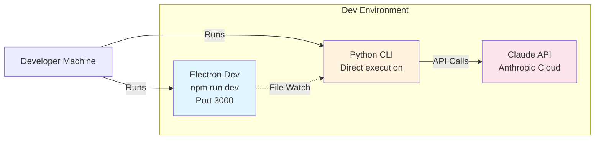
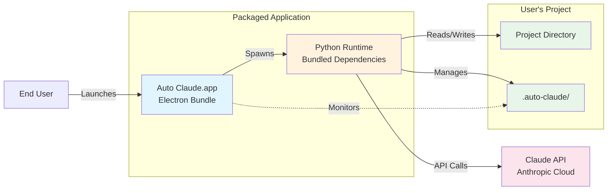

# Auto Claude System Architecture

This document provides a high-level overview of Auto Claude's architecture, showing how the frontend desktop application and backend agent system work together to build software autonomously.

**Target Audience:** Developers who want to understand the overall system design before diving into specific components.

---

## Table of Contents

- [System Overview](#system-overview)
- [High-Level Architecture](#high-level-architecture)
- [Project Structure](#project-structure)
- [Service Relationships](#service-relationships)
- [Data Flow](#data-flow)
- [Communication Patterns](#communication-patterns)
- [Deployment Architecture](#deployment-architecture)
- [Key Architectural Decisions](#key-architectural-decisions)

---

## System Overview

Auto Claude is a **dual-service application** consisting of:

1. **Desktop Frontend** (`auto-claude-ui/`) - An Electron-based React application providing a visual interface for task management, agent terminals, and project insights
2. **Backend Agent System** (`auto-claude/`) - A Python CLI orchestrating AI agents that autonomously plan, code, and validate software features

**Key Concept:** The frontend and backend are **loosely coupled** - they communicate through the filesystem and shell commands rather than traditional HTTP APIs. This design allows:
- The backend to work standalone as a CLI tool
- The frontend to spawn and manage multiple backend processes
- Complete isolation between concurrent builds
- No network dependencies for local development

---

## High-Level Architecture



**Diagram Legend:**
- **Blue** - Frontend (Electron/React)
- **Orange** - Backend Core (Orchestration)
- **Yellow** - Implementation Agents
- **Purple** - Spec Creation Agents
- **Green** - Storage & Isolation
- **Pink** - External Services
- **Solid arrows** - Direct interaction
- **Dashed arrows** - File system monitoring

---

## Project Structure

Auto Claude uses a **dual-repository pattern** where both services live in the same Git repository but operate independently:

```
Auto-Claude/
├── auto-claude/              # Backend (Python)
│   ├── agents/               # Implementation agents
│   ├── spec_agents/          # Spec creation agents
│   ├── core/                 # Core infrastructure
│   ├── integrations/         # External integrations
│   ├── prompts/              # Agent system prompts
│   ├── cli/                  # CLI commands
│   ├── run.py               # Main entry point
│   └── spec_runner.py       # Spec creation entry point
│
├── auto-claude-ui/           # Frontend (Electron + React)
│   ├── src/
│   │   ├── main/            # Electron main process
│   │   ├── renderer/        # React application
│   │   ├── preload/         # Electron preload scripts
│   │   └── shared/          # Shared types/utilities
│   ├── resources/           # Application assets
│   └── package.json         # Node.js dependencies
│
├── .auto-claude/             # Project-specific data (gitignored)
│   ├── specs/               # Task specifications and plans
│   ├── worktrees/           # Isolated git worktrees
│   └── memory/              # Session context and patterns
│
├── tests/                    # Backend unit tests
├── scripts/                  # Build and release scripts
└── guides/                   # User guides and tutorials
```

### Why This Structure?

**1. Independent Operation**
- Backend can run standalone via CLI: `python auto-claude/run.py --spec 001`
- Frontend wraps backend but doesn't require it for UI development
- Each service has its own dependencies and build process

**2. Loose Coupling**
- Services communicate via filesystem (spec files, progress logs)
- No direct API calls between frontend and backend
- Frontend spawns backend as subprocess when needed

**3. Shared Git Repository**
- Simplified version control
- Coordinated releases
- Shared documentation and CI/CD

**This is NOT a traditional monorepo** (no Nx, Turborepo, or shared workspace dependencies). It's two independent applications that share a repository.

---

## Service Relationships

### Frontend → Backend Communication



**Key Points:**
- **Process Spawning** - Frontend spawns backend Python processes as needed
- **File-Based IPC** - Services communicate through shared files in `.auto-claude/`
- **File Watching** - Frontend monitors filesystem for changes to update UI
- **No Network Required** - All communication happens locally via files and processes

---

## Data Flow

### Spec Creation Flow


### Implementation Flow



### Data Storage Layers



---

## Communication Patterns

### 1. Frontend ↔ Backend (File System)

**Pattern:** Process Spawning + File Watching

```typescript
// Frontend: Spawn backend process
const backendProcess = spawn('python', ['auto-claude/run.py', '--spec', '001'], {
  cwd: projectPath,
  env: process.env
});

// Frontend: Watch for file changes
const watcher = chokidar.watch('.auto-claude/specs/001/build-progress.txt');
watcher.on('change', () => {
  const progress = fs.readFileSync('build-progress.txt', 'utf-8');
  updateUI(progress);
});
```

**Why not HTTP/WebSockets?**
- Backend is a CLI tool, not a server
- File-based communication allows offline operation
- No port conflicts or network configuration needed
- Simpler debugging (just read the files)

### 2. Backend Agents ↔ Claude API

**Pattern:** Direct HTTP via Claude SDK

```python
from claude_code import Client

client = Client(
    oauth_token=os.getenv("CLAUDE_CODE_OAUTH_TOKEN"),
    model="claude-sonnet-4-20250514"
)

response = client.run_agent(
    prompt=prompt,
    tools=tools,
    max_turns=50
)
```

### 3. Frontend Components ↔ State

**Pattern:** Zustand State Management

```typescript
// Frontend: Zustand store
const useTaskStore = create<TaskStore>((set) => ({
  tasks: [],
  addTask: (task) => set((state) => ({ tasks: [...state.tasks, task] })),
  updateTask: (id, updates) => set((state) => ({
    tasks: state.tasks.map(t => t.id === id ? { ...t, ...updates } : t)
  }))
}));

// Frontend: React component
const TaskBoard = () => {
  const tasks = useTaskStore(state => state.tasks);
  const addTask = useTaskStore(state => state.addTask);
  // ...
};
```

### 4. Git Worktree Isolation

**Pattern:** Branch-per-task with isolated working directories

```bash
# Backend creates isolated worktree for each build
git worktree add .auto-claude/worktrees/001-feature auto-claude/001-feature

# All changes happen in isolated directory
cd .auto-claude/worktrees/001-feature
# ... make changes ...
git commit -m "auto-claude: implement feature"

# Merge back when approved
git checkout main
git merge --no-ff auto-claude/001-feature
```

**Benefits:**
- Main branch never modified during build
- Multiple builds can run concurrently
- Easy to discard failed builds
- No conflicts between parallel tasks

---

## Deployment Architecture

### Development Mode



### Production Mode (Desktop App)



**Key Packaging Details:**
- **Electron Builder** packages the Electron app with Node.js runtime
- **Python** is bundled (via PyInstaller or system Python) with all dependencies
- **No internet required** except for Claude API calls
- **Cross-platform** - macOS (Intel/Apple Silicon), Windows, Linux

---

## Key Architectural Decisions

### 1. Why File-Based Communication?

**Decision:** Frontend and backend communicate through files rather than HTTP API.

**Rationale:**
- Backend must work as standalone CLI tool (primary use case)
- File watching is simple and reliable for progress updates
- No network configuration or port management needed
- Debugging is easier (just read the files)
- Supports offline operation (except Claude API calls)

**Trade-offs:**
- ❌ Slight delay in UI updates (file polling)
- ✅ Simpler architecture
- ✅ No server management complexity

### 2. Why Git Worktrees?

**Decision:** Each build runs in an isolated git worktree on a separate branch.

**Rationale:**
- Main branch remains untouched during builds
- Multiple builds can run in parallel without conflicts
- Easy to discard failed builds (just delete worktree)
- Safe experimentation - nothing affects production code
- Natural rollback mechanism (just don't merge)

**Trade-offs:**
- ❌ Additional disk space for worktrees
- ✅ Complete isolation between builds
- ✅ Parallel execution without conflicts

### 3. Why Dual Memory System?

**Decision:** File-based memory (always available) + optional Graphiti (semantic search).

**Rationale:**
- File-based memory has zero dependencies and always works
- Graphiti requires Python 3.12+ and external API keys
- Not all users want graph database complexity
- File memory is human-readable for debugging

**Trade-offs:**
- ❌ Maintaining two memory systems
- ✅ Works for all users (file-based)
- ✅ Advanced users get semantic search (Graphiti)

### 4. Why Multi-Agent Architecture?

**Decision:** Separate agents for planning, coding, QA review, and QA fixing.

**Rationale:**
- **Separation of concerns** - Each agent has a focused role
- **Better prompts** - Specialized prompts for each phase
- **Failure isolation** - QA agent can reject without affecting planner
- **Parallel execution** - Coder agent can spawn subagents for concurrent work

**Trade-offs:**
- ❌ More complex orchestration
- ✅ Higher quality output
- ✅ Better error recovery

### 5. Why Spec-First Approach?

**Decision:** Always create a detailed spec before implementation.

**Rationale:**
- Forces clear requirements gathering
- Provides context for all agents in the pipeline
- User can review/approve plan before code is written
- Enables accurate progress tracking
- Documents decision-making process

**Trade-offs:**
- ❌ Additional upfront time for spec creation
- ✅ Fewer misunderstandings and rework
- ✅ Better documentation

---

## Next Steps

Now that you understand the overall architecture:

- **Frontend developers** → Read [Frontend Architecture](./frontend/architecture.md)
- **Backend developers** → Read [Backend Architecture](./backend/architecture.md)
- **Set up your environment** → Follow [Setup Guide](./setup.md)
- **Learn the workflow** → Check [Development Workflows](./workflows.md)

---

**Need help?** Join our [Discord community](https://discord.gg/KCXaPBr4Dj) or open an issue on [GitHub](https://github.com/AndyMik90/Auto-Claude/issues).
