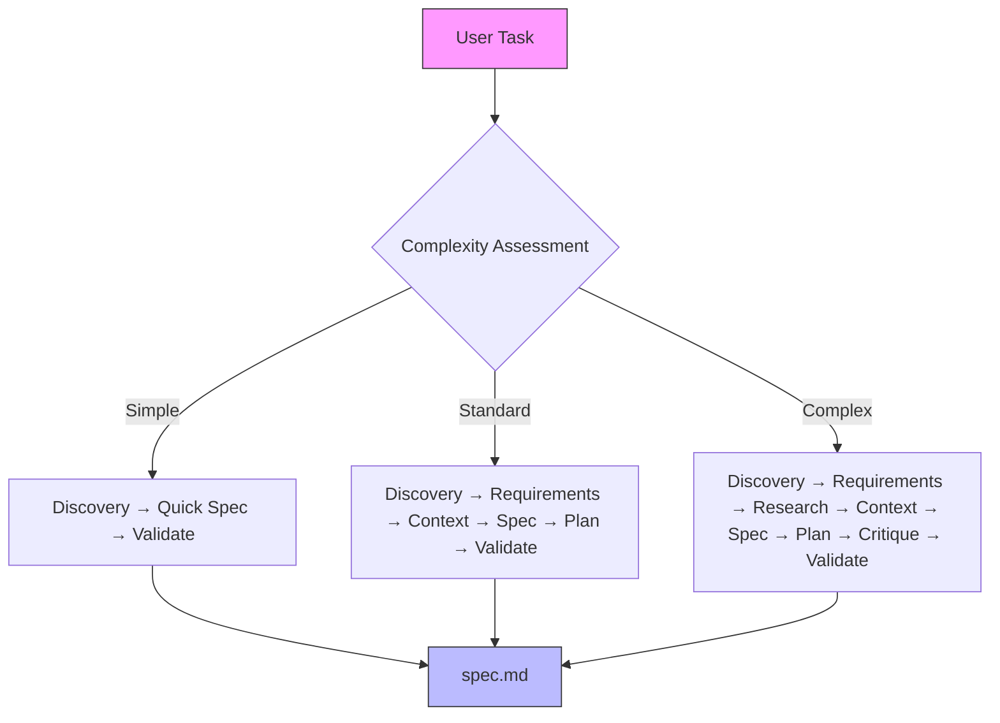
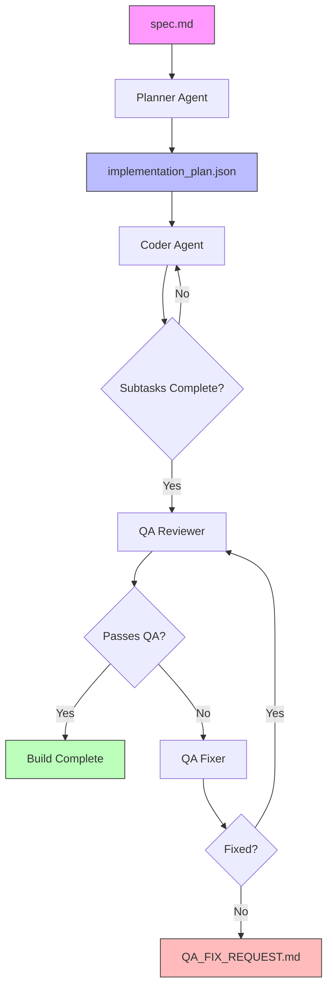

# Backend Documentation

This documentation covers the Auto-Claude backend system - a Python-based autonomous coding framework that orchestrates AI agents to build software through coordinated sessions.

## Overview

The Auto-Claude backend is a CLI-based framework that uses the Claude Agent SDK to run AI agents in isolated workspaces with security controls. It implements a multi-agent pipeline for both spec creation and feature implementation, with built-in security sandboxing, memory management, and worktree isolation.

**Key capabilities:**
- Multi-agent spec creation pipeline (8 phases for complex tasks)
- Autonomous implementation with subtask-based planning
- Built-in QA validation and issue resolution
- Git worktree isolation for safe parallel development
- Optional graph-based memory with Graphiti
- Security model with command allowlisting and OS sandboxing

## Tech Stack

### Core Technologies

| Technology | Purpose | Version |
|------------|---------|---------|
| Python | Primary language | 3.12+ |
| Claude Agent SDK | AI agent orchestration | Latest |
| Graphiti Core | Knowledge graph memory | Latest |
| LadybugDB | Embedded graph database | Latest |
| Pydantic | Data validation and models | Latest |

### Key Libraries

- **claude-agent-sdk** - AI agent orchestration and Claude API integration
- **graphiti-core** - Knowledge graph memory with semantic search
- **real_ladybug** - Embedded graph database (no Docker required)
- **python-dotenv** - Environment configuration management
- **sentry-sdk** - Error monitoring and tracking
- **pydantic** - Data validation and type safety

### Package Management

The project supports two package managers:
- **uv** (recommended) - Fast Python package installer
- **pip** - Standard Python package manager

## Folder Structure

```
auto-claude/
├── agents/                      # Implementation agents
│   ├── planner.py              # Creates subtask-based implementation plans
│   ├── coder.py                # Implements individual subtasks
│   ├── qa_reviewer.py          # Validates acceptance criteria
│   ├── qa_fixer.py             # Fixes QA-reported issues
│   ├── memory_manager.py       # Session memory management
│   └── tools_pkg/              # Custom agent tools
│       ├── tools/              # Tool implementations
│       │   ├── memory.py       # Memory operations
│       │   ├── progress.py     # Progress tracking
│       │   ├── qa.py           # QA operations
│       │   └── subtask.py      # Subtask management
│       ├── models.py           # Tool data models
│       ├── permissions.py      # Tool permission management
│       └── registry.py         # Tool registration
│
├── spec_agents/                 # Spec creation agents (not shown in file list)
│   ├── gatherer.py             # Collects user requirements
│   ├── researcher.py           # Validates external integrations
│   ├── writer.py               # Creates spec.md document
│   └── critic.py               # Self-critique using ultrathink
│
├── core/                        # Core infrastructure
│   ├── client.py               # Claude SDK client with security hooks
│   ├── auth.py                 # Authentication management
│   ├── agent.py                # Base agent implementation
│   ├── workspace.py            # Workspace management
│   ├── worktree.py             # Git worktree isolation
│   ├── progress.py             # Build progress tracking
│   └── workspace/              # Workspace utilities
│       ├── setup.py            # Workspace setup
│       ├── git_utils.py        # Git operations
│       ├── display.py          # Status display
│       └── finalization.py     # Workspace cleanup
│
├── analysis/                    # Codebase analysis
│   ├── analyzer.py             # Main analyzer
│   ├── project_analyzer.py     # Project structure analysis
│   ├── security_scanner.py     # Security analysis
│   ├── test_discovery.py       # Test discovery
│   └── analyzers/              # Specialized analyzers
│       ├── framework_analyzer.py
│       ├── database_detector.py
│       ├── port_detector.py
│       └── context/            # Context detectors
│           ├── api_docs_detector.py
│           ├── auth_detector.py
│           ├── env_detector.py
│           └── services_detector.py
│
├── context/                     # Context gathering and management
│   ├── builder.py              # Context building
│   ├── search.py               # Code search
│   ├── categorizer.py          # File categorization
│   ├── pattern_discovery.py   # Pattern extraction
│   └── graphiti_integration.py # Graphiti memory integration
│
├── integrations/                # External service integrations
│   ├── graphiti/               # Graph memory integration
│   ├── linear/                 # Linear project management
│   └── electron_mcp/           # Electron MCP server
│
├── cli/                         # Command-line interface
│   ├── main.py                 # CLI entry point
│   ├── build_commands.py       # Build execution commands
│   ├── spec_commands.py        # Spec creation commands
│   ├── qa_commands.py          # QA validation commands
│   └── workspace_commands.py   # Workspace management
│
├── prompts/                     # Agent system prompts
│   ├── planner.md              # Planner agent prompt
│   ├── coder.md                # Coder agent prompt
│   ├── coder_recovery.md       # Recovery prompt for stuck tasks
│   ├── qa_reviewer.md          # QA reviewer prompt
│   ├── qa_fixer.md             # QA fixer prompt
│   ├── spec_gatherer.md        # Spec gatherer prompt
│   ├── spec_researcher.md      # Spec researcher prompt
│   ├── spec_writer.md          # Spec writer prompt
│   └── spec_critic.md          # Spec critic prompt
│
├── run.py                       # Main orchestrator for builds
├── spec_runner.py              # Spec creation pipeline
├── validate_spec.py            # Spec validation tool
└── requirements.txt            # Python dependencies
```

## Agent Pipeline Overview

Auto-Claude uses two distinct multi-agent pipelines:

### 1. Spec Creation Pipeline

Dynamic 3-8 phase pipeline based on task complexity:



**Phases:**
1. **Discovery** - Analyzes codebase structure and patterns
2. **Requirements** (Standard/Complex) - Collects user requirements
3. **Research** (Complex only) - Validates external integrations
4. **Context** (Standard/Complex) - Builds service context
5. **Spec** - Writes specification document
6. **Plan** (Standard/Complex) - Creates initial implementation plan
7. **Critique** (Complex only) - Self-reviews using ultrathink
8. **Validate** - Validates spec completeness

### 2. Implementation Pipeline

Multi-session build with autonomous agents:



**Agents:**
1. **Planner Agent** - Creates subtask-based implementation plan
2. **Coder Agent** - Implements subtasks (can spawn subagents for parallel work)
3. **QA Reviewer** - Validates acceptance criteria
4. **QA Fixer** - Resolves issues in a loop

## Quick Start Commands

### Setup

```bash
# Install dependencies (from project root)
cd auto-claude
uv venv && uv pip install -r requirements.txt
# Or: python3 -m venv .venv && source .venv/bin/activate && pip install -r requirements.txt

# Set up OAuth token
claude setup-token
# Add to auto-claude/.env: CLAUDE_CODE_OAUTH_TOKEN=your-token
```

### Creating Specs

```bash
# Create a spec interactively
python auto-claude/spec_runner.py --interactive

# Create spec from task description
python auto-claude/spec_runner.py --task "Add user authentication"

# Force complexity level (simple/standard/complex)
python auto-claude/spec_runner.py --task "Fix button" --complexity simple

# List all specs
python auto-claude/run.py --list
```

### Running Builds

```bash
# Run autonomous build
python auto-claude/run.py --spec 001

# Review changes in isolated worktree
python auto-claude/run.py --spec 001 --review

# Run QA manually
python auto-claude/run.py --spec 001 --qa

# Check QA status
python auto-claude/run.py --spec 001 --qa-status
```

### Workspace Management

```bash
# Merge completed build into project
python auto-claude/run.py --spec 001 --merge

# Discard build
python auto-claude/run.py --spec 001 --discard
```

### Testing

```bash
# Install test dependencies (required first time)
cd auto-claude && uv pip install -r ../tests/requirements-test.txt

# Run all tests (use virtual environment pytest)
auto-claude/.venv/bin/pytest tests/ -v

# Run single test file
auto-claude/.venv/bin/pytest tests/test_security.py -v

# Run specific test
auto-claude/.venv/bin/pytest tests/test_security.py::test_bash_command_validation -v

# Skip slow tests
auto-claude/.venv/bin/pytest tests/ -m "not slow"
```

## Detailed Documentation

For in-depth information on specific backend components and concepts, see:

### Architecture & Design
- **[Architecture](./architecture.md)** - Backend architecture, agent orchestration, and system design
- **[Agents](./agents.md)** - Agent system, roles, and workflow patterns
- **[Security](./security.md)** - Security model, sandboxing, and command allowlisting

### Memory & Data
- **[Memory System](./memory.md)** - Graphiti memory, session context, and cross-session retrieval
- **[Context Management](./context.md)** - Codebase context gathering and service matching (if created)

### Integrations
- **[External Integrations](./integrations.md)** - Linear, GitHub, and Electron MCP integrations
- **[Graphiti Providers](./memory.md#graphiti-providers)** - Multi-provider configuration for Graphiti

### Development
- **[Testing Strategies](../testing.md)** - Unit tests, E2E tests, and QA validation
- **[Development Workflows](../workflows.md)** - Spec creation, build execution, and merge process

## Entry Points

### Main Orchestrator (`run.py`)

The primary entry point for executing builds:

```bash
python auto-claude/run.py --spec 001
```

**Responsibilities:**
- Initializes the workspace with git worktree isolation
- Orchestrates the multi-agent build pipeline
- Manages progress tracking and error handling
- Handles QA validation and merge operations

### Spec Creation (`spec_runner.py`)

Entry point for creating specifications:

```bash
python auto-claude/spec_runner.py --interactive
```

**Responsibilities:**
- Runs the dynamic spec creation pipeline
- Assesses task complexity
- Coordinates spec agents (gatherer, researcher, writer, critic)
- Validates and outputs spec documents

### Spec Validation (`validate_spec.py`)

Tool for validating spec completeness:

```bash
python auto-claude/validate_spec.py --spec-dir .auto-claude/specs/001-feature --checkpoint all
```

**Responsibilities:**
- Validates spec file structure
- Checks for required sections and content
- Verifies checkpoint completion

## Development Tips

### Debugging Agents

Enable debug logging to see agent interactions:

```bash
# Set in .env
DEBUG=true
```

### Working with Worktrees

All builds run in isolated git worktrees. Find them at:

```
.auto-claude/worktrees/{spec-name}/
```

Review changes before merging:

```bash
cd .auto-claude/worktrees/tasks/001-my-feature
git diff main
```

### Memory Management

- **File-based memory** is always enabled (zero dependencies)
- **Graphiti memory** requires Python 3.12+ and provider credentials
- Memory files are stored in `.auto-claude/specs/XXX/memory/`

### Security Best Practices

- All bash commands are sandboxed and allowlisted
- File operations are restricted to the project directory
- Security profiles are cached in `.auto-claude-security.json`
- Review security model at [Security Documentation](./security.md)

## Common Issues

### Virtual Environment Not Found

```bash
# Recreate virtual environment
cd auto-claude
rm -rf .venv
uv venv && uv pip install -r requirements.txt
```

### Worktree Conflicts

```bash
# Clean up orphaned worktrees
git worktree prune

# Remove specific worktree
git worktree remove .auto-claude/worktrees/tasks/001-feature
```

### Graphiti Memory Errors

Requires Python 3.12+:

```bash
python --version  # Check version
# If < 3.12, disable Graphiti in .env:
GRAPHITI_ENABLED=false
```

## Next Steps

- Explore the [Architecture Documentation](./architecture.md) to understand system design
- Read [Agent System](./agents.md) to learn how agents coordinate
- Review [Security Model](./security.md) for safety guarantees
- Check [Memory System](./memory.md) for session context management
