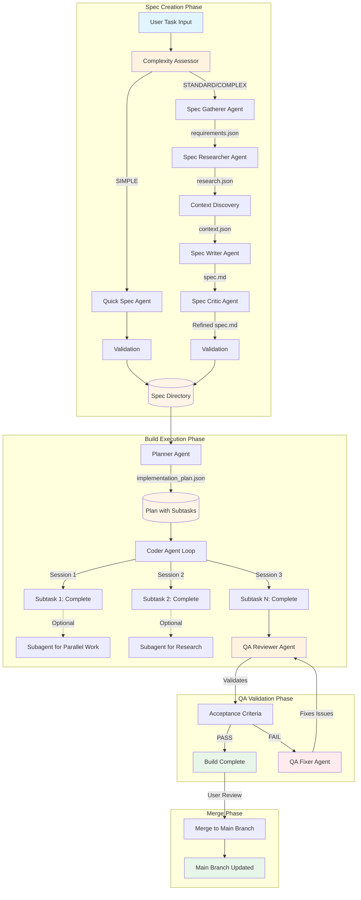

# Agent System

This document explains the Auto-Claude agent system for developers. The agent system is the core of Auto-Claude's autonomous development capabilities, orchestrating specialized AI agents to build software through coordinated sessions.

## Overview

Auto-Claude uses a **multi-agent architecture** where different AI agents handle different phases of development:

- **Spec Creation Agents** - Gather requirements, research integrations, write specifications
- **Planner Agent** - Creates implementation plans with subtasks
- **Coder Agent** - Implements individual subtasks (can spawn subagents for parallel work)
- **QA Reviewer Agent** - Validates acceptance criteria
- **QA Fixer Agent** - Resolves reported issues

Each agent runs in a **fresh context window** with access to file-based context (spec files, plans, memory) and specialized prompts that define their role and constraints.

## Agent Workflow

The complete build pipeline uses different agents at different stages:



## Build Execution Agents

These agents handle the actual implementation of features.

### Planner Agent

**Purpose:** Creates a subtask-based implementation plan from the spec

**Prompt:** `auto-claude/prompts/planner.md`

**Entry Point:** `auto-claude/agents/planner.py`

**Lifecycle:**
- Runs **once** at the start of a build (Session 1)
- Runs again for **follow-up planning** when user adds work to completed spec

**Responsibilities:**
1. **Deep Codebase Investigation** - Search for similar patterns, read existing code, understand project structure
2. **Read Context Files** - Load `spec.md`, `project_index.json`, `context.json`
3. **Create Implementation Plan** - Generate `implementation_plan.json` with phases and subtasks
4. **Define Verification** - Specify how each subtask should be verified

**Output:** `implementation_plan.json` - Structured plan with subtasks grouped by phase

**Example Plan Structure:**
```json
{
  "phases": [
    {
      "name": "Backend API",
      "subtasks": [
        {
          "id": "subtask-1-1",
          "description": "Create user authentication endpoint",
          "status": "pending",
          "files_to_create": ["app/routes/auth.py"],
          "files_to_modify": ["app/main.py"],
          "verification": "Run: pytest tests/test_auth.py"
        }
      ]
    }
  ]
}
```

**Key Features:**
- **Subtask-Based Planning** - Each subtask is a unit of work scoped to one service
- **Phase Dependencies** - Backend first, then frontend (respects dependencies)
- **Pattern Discovery** - Finds and follows existing code patterns
- **Verification Specs** - Defines how to verify each subtask completion

**Implementation Details:**

From `auto-claude/agents/coder.py`:
```python
async def run_autonomous_agent(
    project_dir: Path,
    spec_dir: Path,
    model: str,
    max_iterations: int | None = None,
    verbose: bool = False,
    source_spec_dir: Path | None = None,
):
    """Run the autonomous agent loop with automatic memory management."""
    recovery_manager = RecoveryManager(spec_dir, project_dir)
    status_manager = StatusManager(project_dir)

    # Check if this is a fresh start (first session = planning)
    first_run = is_first_run(spec_dir)

    if first_run:
        # Session 1: Planner Agent
        current_log_phase = LogPhase.PLANNING
        prompt = generate_planner_prompt(spec_dir, project_dir)
        # ... run planning session
        first_run = False
    else:
        # Session 2+: Coder Agent
        current_log_phase = LogPhase.CODING
        next_subtask = get_next_subtask(spec_dir)
        prompt = generate_subtask_prompt(spec_dir, project_dir, next_subtask)
        # ... run coding session
```

### Coder Agent

**Purpose:** Implements individual subtasks from the implementation plan

**Prompt:** `auto-claude/prompts/coder.md`

**Recovery Prompt:** `auto-claude/prompts/coder_recovery.md`

**Entry Point:** `auto-claude/agents/coder.py`

**Lifecycle:**
- Runs in a **loop** (Session 2, 3, 4, ...) until all subtasks complete
- Each session = fresh context window
- Auto-continues between sessions (3s delay)

**Responsibilities:**
1. **Load Context** - Read implementation plan, spec, memory from previous sessions
2. **Get Next Subtask** - Find first pending subtask from plan
3. **Read Pattern Files** - Load files specified in `patterns` field
4. **Implement Subtask** - Write code, following existing patterns
5. **Verify Changes** - Run tests/commands from `verification` field
6. **Commit Changes** - Git commit with descriptive message
7. **Update Plan** - Mark subtask as "completed" in `implementation_plan.json`

**Subagent Spawning:**
The coder agent can spawn **subagents** for parallel execution using the SDK's `Task` tool:

```python
# Example: Coder decides to spawn subagent for parallel research
# While implementing a subtask, agent realizes it needs to research an API
# It spawns a subagent to do research while continuing with implementation

# This is decided by the agent itself - no hardcoded rules
# The agent's prompt explains when subagents are useful
```

**Key Features:**
- **Focused Prompts** - Only includes context for current subtask (not entire spec)
- **Pattern Following** - Reads similar files to understand conventions
- **Recovery System** - Tracks failed attempts, provides hints for retry
- **Memory Integration** - Learns from previous sessions via file-based memory
- **Graphiti Context** - Optional semantic search of past discoveries

**Session Flow:**

From `auto-claude/agents/coder.py`:
```python
while True:
    # Get next subtask
    next_subtask = get_next_subtask(spec_dir)
    subtask_id = next_subtask.get("id")

    # Generate focused prompt for this subtask only
    prompt = generate_subtask_prompt(
        spec_dir=spec_dir,
        project_dir=project_dir,
        subtask=next_subtask,
        phase=phase,
        attempt_count=attempt_count,
        recovery_hints=recovery_hints,
    )

    # Load file context (patterns, files to modify)
    context = load_subtask_context(spec_dir, project_dir, next_subtask)
    if context.get("patterns") or context.get("files_to_modify"):
        prompt += "\n\n" + format_context_for_prompt(context)

    # Retrieve Graphiti memory context (if enabled)
    graphiti_context = await get_graphiti_context(spec_dir, project_dir, next_subtask)
    if graphiti_context:
        prompt += "\n\n" + graphiti_context

    # Run session
    async with client:
        status, response = await run_agent_session(
            client, prompt, spec_dir, verbose, phase=LogPhase.CODING
        )

    # Post-session processing (memory, recovery, Linear)
    success = await post_session_processing(...)

    # Check if build complete
    if is_build_complete(spec_dir):
        break
```

**Recovery System:**

From `auto-claude/agents/session.py`:
```python
# Track failed attempts
recovery_manager.record_attempt(
    subtask_id=subtask_id,
    session=session_num,
    success=False,
    approach="Session ended with subtask in_progress",
    error="Subtask not marked as completed",
)

# After 3 failed attempts, mark as stuck
if not success and attempt_count >= 3:
    recovery_manager.mark_subtask_stuck(
        subtask_id, f"Failed after {attempt_count} attempts"
    )
```

### QA Reviewer Agent

**Purpose:** Validates that the implementation meets all acceptance criteria

**Prompt:** `auto-claude/prompts/qa_reviewer.md`

**Lifecycle:**
- Runs **once** after all subtasks are marked complete
- Uses extended thinking (high: 10K tokens) for thorough analysis

**Responsibilities:**
1. **Load Context** - Read spec, implementation plan, changes made
2. **Start Development Environment** - Run `./init.sh` to start all services
3. **Run Automated Tests** - Execute unit, integration, and E2E tests
4. **Manual Testing** - Test acceptance criteria interactively (browser, API, etc.)
5. **Check Edge Cases** - Verify error handling, security, performance
6. **Generate QA Report** - Document findings in `qa_report.md`
7. **Update QA Sign-off** - Set `qa_signoff.status` in `implementation_plan.json` to "approved" or "rejected"

**Browser Automation:**
QA agents have access to **Puppeteer** (web apps) or **Electron MCP** (desktop apps) for automated UI testing:

```python
# Example: QA agent tests login flow
await puppeteer_navigate("http://localhost:3000/login")
await puppeteer_fill("input[name='email']", "test@example.com")
await puppeteer_fill("input[name='password']", "password123")
await puppeteer_click("button[type='submit']")
screenshot = await puppeteer_screenshot()
```

**QA Report Format:**
```markdown
# QA Report

## Status: APPROVED | REJECTED

## Test Results

### Unit Tests
- ✅ Backend: 45/45 passed
- ✅ Frontend: 32/32 passed

### Integration Tests
- ✅ API endpoints functional
- ❌ WebSocket connection fails on reconnect

## Issues Found
1. **WebSocket reconnection broken** (BLOCKER)
   - Location: `app/websocket.py:45`
   - Expected: Client reconnects after disconnect
   - Actual: Connection hangs indefinitely
```

### QA Fixer Agent

**Purpose:** Fixes issues reported by the QA Reviewer

**Prompt:** `auto-claude/prompts/qa_fixer.md`

**Lifecycle:**
- Runs in a **loop** until QA Reviewer approves (or max retries reached)
- Each iteration = attempt to fix all reported issues

**Responsibilities:**
1. **Load QA Fix Request** - Read `QA_FIX_REQUEST.md` (created by QA Reviewer)
2. **Parse Issues** - Understand what's broken and where
3. **Fix Issues One by One** - Address each issue systematically
4. **Verify Fixes** - Run tests to confirm fixes work
5. **Commit Changes** - Git commit with fix descriptions
6. **Trigger QA Re-review** - QA Reviewer runs again automatically

**Fix Request Format:**
```markdown
# QA Fix Request

## Issues to Fix

### 1. WebSocket reconnection broken (BLOCKER)
- **Location:** `app/websocket.py:45`
- **Problem:** Connection hangs after disconnect
- **Fix:** Add reconnection logic with exponential backoff
- **Verify:** Run `pytest tests/test_websocket.py::test_reconnect`
```

**QA Loop Flow:**

```python
# Managed by run.py with --qa flag
while True:
    # Run QA Reviewer
    qa_status = await run_qa_reviewer(spec_dir)

    if qa_status == "approved":
        print("QA approved! Build complete.")
        break
    elif qa_status == "rejected":
        # Create QA_FIX_REQUEST.md from qa_report.md
        create_fix_request(spec_dir)

        # Run QA Fixer
        await run_qa_fixer(spec_dir)

        # Loop back to QA Reviewer
    else:
        print("QA error - manual intervention needed")
        break
```

## Spec Creation Agents

These agents handle the specification creation phase before implementation.

### Complexity Assessor Agent

**Purpose:** Determines task complexity to route to appropriate spec pipeline

**Prompt:** `auto-claude/prompts/complexity_assessor.md`

**Output:** Complexity level (SIMPLE, STANDARD, COMPLEX)

**Routing Logic:**
- **SIMPLE** → Quick Spec Agent (3 phases)
- **STANDARD** → Full pipeline without Research (6-7 phases)
- **COMPLEX** → Full pipeline with Research + Critic (8 phases)

### Spec Gatherer Agent

**Purpose:** Collects user requirements interactively or from task description

**Prompt:** `auto-claude/prompts/spec_gatherer.md`

**Output:** `requirements.json`

**Responsibilities:**
1. **Load Project Index** - Read `project_index.json` to understand project structure
2. **Parse Task Description** - Extract requirements from user input
3. **Ask Clarifying Questions** - Interactive mode for ambiguous requests
4. **Identify Services** - Determine which services are affected
5. **Define Acceptance Criteria** - Clear criteria for "done"
6. **Write Requirements File** - Structured JSON output

**Output Format:**
```json
{
  "task_description": "Add user authentication with JWT tokens",
  "workflow_type": "feature",
  "services_involved": ["backend", "frontend"],
  "user_requirements": [
    "Users can register with email/password",
    "Users can login and receive JWT token",
    "Protected routes require valid token"
  ],
  "acceptance_criteria": [
    "Registration endpoint creates user in database",
    "Login endpoint returns valid JWT token",
    "Protected routes return 401 without token"
  ],
  "constraints": [
    "Must use existing Auth0 integration",
    "Passwords must be hashed with bcrypt"
  ]
}
```

### Spec Researcher Agent

**Purpose:** Validates external integrations, libraries, and dependencies

**Prompt:** `auto-claude/prompts/spec_researcher.md`

**Output:** `research.json`

**Responsibilities:**
1. **Load Requirements** - Read `requirements.json` to identify dependencies
2. **Research Each Integration** - Use Context7 MCP to look up documentation
3. **Validate Package Names** - Ensure correct package names and versions
4. **Document API Patterns** - Record correct import statements and usage
5. **Check Compatibility** - Verify library versions work with project stack
6. **Write Research File** - Structured findings for spec writer

**Example Research Output:**
```json
{
  "integrations": [
    {
      "name": "stripe",
      "type": "payment",
      "package": "stripe",
      "version": "^10.0.0",
      "docs_url": "https://stripe.com/docs/api",
      "api_key_required": true,
      "setup_steps": [
        "npm install stripe",
        "Add STRIPE_SECRET_KEY to .env"
      ],
      "code_examples": [
        "const stripe = require('stripe')(process.env.STRIPE_SECRET_KEY);"
      ]
    }
  ]
}
```

**Context7 Usage:**

From `auto-claude/prompts/spec_researcher.md`:
```markdown
### 1.1: Use Context7 MCP (PRIMARY RESEARCH TOOL)

#### Step 1: Resolve the Library ID
Tool: mcp__context7__resolve-library-id
Input: { "libraryName": "stripe", "query": "payment processing" }

#### Step 2: Query Documentation
Tool: mcp__context7__query-docs
Input: { "libraryId": "/stripe/stripe-node", "query": "create payment intent" }
```

### Spec Writer Agent

**Purpose:** Synthesizes all context into a complete `spec.md` document

**Prompt:** `auto-claude/prompts/spec_writer.md`

**Output:** `spec.md`

**Responsibilities:**
1. **Load All Context** - Read `project_index.json`, `requirements.json`, `context.json`, `research.json`
2. **Analyze Implementation Strategy** - Determine optimal build order
3. **Write Complete Spec** - All required sections (scope, services, files, criteria, etc.)
4. **Include Code Examples** - Show expected patterns and imports
5. **Define Verification** - Specify how to test the feature

**Spec Structure:**
```markdown
# Feature Name

## Overview
High-level description of what's being built

## Workflow Type
feature | refactor | investigation | migration | simple

## Services Involved
- **backend** - API endpoints for authentication
- **frontend** - Login/register forms and protected routes

## Files to Modify
### Backend
- `app/routes/auth.py` - Add login/register endpoints
- `app/models/user.py` - Add User model

### Frontend
- `src/pages/Login.tsx` - Create login form
- `src/utils/auth.ts` - Add token management

## Files to Reference (Patterns)
- `app/routes/posts.py` - Existing API endpoint pattern
- `src/pages/Dashboard.tsx` - Existing authenticated page

## Implementation Strategy
1. Backend first (database, models, endpoints)
2. Frontend forms and authentication
3. Token management and protected routes
4. Testing and error handling

## QA Acceptance Criteria
- [ ] Users can register with email/password
- [ ] Users can login and receive JWT token
- [ ] Protected routes require valid token
- [ ] Invalid credentials show error message
```

### Spec Critic Agent

**Purpose:** Self-critique the spec using extended thinking to find issues

**Prompt:** `auto-claude/prompts/spec_critic.md`

**Thinking Budget:** ultrathink (16K tokens)

**Output:**
- Refined `spec.md` (if issues found)
- `critique_report.json` (summary of issues and fixes)

**Responsibilities:**
1. **Deep Analysis** - Use extended thinking to find problems
2. **Technical Accuracy** - Compare spec against research findings
3. **Pattern Consistency** - Verify spec follows existing code patterns
4. **Completeness Check** - Ensure all requirements are addressed
5. **Risk Assessment** - Identify potential issues before implementation
6. **Fix Issues** - Update `spec.md` directly with corrections

**Critique Areas:**
- **Package Names** - Match research.json findings
- **Import Statements** - Correct syntax from documentation
- **API Calls** - Proper function signatures
- **File Locations** - Paths match project structure
- **Dependencies** - Build order respects dependencies
- **Missing Requirements** - No gaps in acceptance criteria

## Agent Prompt System

Each agent is guided by a **specialized prompt** that defines its role, constraints, and workflow.

### Prompt Structure

All agent prompts follow a consistent structure:

```markdown
## YOUR ROLE - [AGENT TYPE]

[Description of agent's purpose and constraints]

**Key Principle**: [Core guiding principle]

---

## PHASE 0: LOAD CONTEXT (MANDATORY)

[Bash commands to read all necessary context files]

---

## PHASE 1-N: [WORKFLOW STEPS]

[Step-by-step instructions for what the agent should do]

---

## OUTPUT REQUIREMENTS

[What files the agent must create/update]

---

## QUALITY CHECKLIST

[Criteria for successful completion]
```

### Context Loading Pattern

All agents start by loading context from files:

```bash
# Common context loading pattern
cat spec.md                      # Requirements and acceptance criteria
cat implementation_plan.json     # Current plan and subtask status
cat project_index.json           # Project structure and services
cat build-progress.txt           # Progress from previous sessions

# Memory system (codebase knowledge)
cat memory/codebase_map.json     # What files do what
cat memory/patterns.md           # Code patterns to follow
cat memory/gotchas.md            # Pitfalls to avoid
cat memory/session_insights/*.json  # Recent session learnings
```

### Fresh Context Windows

Each agent session runs in a **fresh context window**:

**Why Fresh Context?**
- Prevents context pollution from previous sessions
- Keeps token usage low (only load what's needed)
- Forces agents to read files (reliable source of truth)
- Allows different agents to have different contexts

**How Context is Preserved:**
- All important information is written to files
- Agents read files at the start of each session
- Memory system captures learnings between sessions
- Recovery system tracks failed attempts

**Example from Coder Prompt:**

From `auto-claude/prompts/coder.md`:
```markdown
## YOUR ROLE - CODING AGENT

You are continuing work on an autonomous development task. This is a **FRESH context window** -
you have no memory of previous sessions. Everything you know must come from files.

**Key Principle**: Work on ONE subtask at a time. Complete it. Verify it. Move on.

## STEP 1: GET YOUR BEARINGS (MANDATORY)

# 1. Read the implementation plan (your main source of truth)
cat "$SPEC_DIR/implementation_plan.json"

# 2. Read the project spec (requirements, patterns, scope)
cat "$SPEC_DIR/spec.md"

# 3. Read progress from previous sessions
cat "$SPEC_DIR/build-progress.txt"

# 4. READ SESSION MEMORY (CRITICAL - Learn from past sessions)
cat "$SPEC_DIR/memory/codebase_map.json"
cat "$SPEC_DIR/memory/patterns.md"
cat "$SPEC_DIR/memory/gotchas.md"
```

### Prompt Composition

Prompts are composed dynamically based on context:

**Planner Prompt:**
```python
def generate_planner_prompt(spec_dir: Path, project_dir: Path) -> str:
    """Generate planner prompt with spec and project context."""
    prompt = load_prompt_template("planner.md")

    # Add spec content inline
    spec_content = (spec_dir / "spec.md").read_text()
    prompt += f"\n\n## SPEC TO IMPLEMENT\n\n{spec_content}"

    # Add project index inline
    project_index = (spec_dir / "project_index.json").read_text()
    prompt += f"\n\n## PROJECT INDEX\n\n```json\n{project_index}\n```"

    return prompt
```

**Coder Prompt (Focused):**
```python
def generate_subtask_prompt(
    spec_dir: Path,
    project_dir: Path,
    subtask: dict,
    phase: dict,
    attempt_count: int,
    recovery_hints: list[str] | None,
) -> str:
    """Generate focused prompt for a single subtask."""
    # Base coder prompt
    prompt = load_prompt_template("coder.md")

    # Add ONLY this subtask's info (not entire plan)
    prompt += f"\n\n## YOUR CURRENT SUBTASK\n\n"
    prompt += f"**ID:** {subtask['id']}\n"
    prompt += f"**Description:** {subtask['description']}\n"
    prompt += f"**Phase:** {phase['name']}\n"

    # Add recovery hints if this is a retry
    if attempt_count > 0 and recovery_hints:
        prompt += "\n\n## RECOVERY HINTS (from previous attempts)\n\n"
        for hint in recovery_hints:
            prompt += f"- {hint}\n"

    return prompt
```

### Tool Permissions by Agent

Different agents have access to different tools:

**Implementation:**

From `auto-claude/core/client.py`:
```python
def create_client(
    project_dir: Path,
    spec_dir: Path,
    model: str,
    max_thinking_tokens: int | None = None,
    agent_type: str = "coder",
) -> ClaudeSDKClient:
    """Create Claude SDK client with agent-specific tools."""

    # Base tools (all agents)
    base_tools = ["Read", "Write", "Edit", "Glob", "Grep", "Bash"]

    # Agent-specific MCP tools
    if agent_type in ["planner", "coder"]:
        # Auto-claude tools for build progress and memory
        mcp_servers["auto-claude"] = create_auto_claude_mcp_server(
            spec_dir, project_dir
        )

    if agent_type in ["qa_reviewer", "qa_fixer"]:
        # Browser automation tools
        if project_capabilities["is_web_frontend"]:
            mcp_servers["puppeteer"] = {...}
        elif project_capabilities["is_electron"]:
            mcp_servers["electron"] = {...}

    return ClaudeSDKClient(
        model=model,
        tools=base_tools,
        mcp_servers=mcp_servers,
        max_thinking_tokens=max_thinking_tokens,
    )
```

## Memory and Session Management

Agents learn from previous sessions through a **memory system** that persists discoveries across sessions.

### File-Based Memory (Primary)

**Location:** `{spec_dir}/memory/`

**Files:**
- `codebase_map.json` - File purposes and responsibilities
- `patterns.md` - Code patterns to follow
- `gotchas.md` - Pitfalls and edge cases to avoid
- `session_insights/session_*.json` - Per-session learnings

**Example Codebase Map:**
```json
{
  "files": [
    {
      "path": "app/routes/auth.py",
      "purpose": "User authentication endpoints (login, register, logout)",
      "key_functions": ["login", "register", "verify_token"],
      "dependencies": ["app/models/user.py", "app/utils/jwt.py"]
    }
  ]
}
```

**Example Patterns:**
```markdown
# Code Patterns to Follow

## API Endpoint Pattern
All API endpoints in this project follow this structure:

@router.post("/endpoint")
async def endpoint_name(data: SchemaModel):
    try:
        result = await service_function(data)
        return {"success": True, "data": result}
    except Exception as e:
        logger.error(f"Error: {e}")
        raise HTTPException(status_code=500, detail=str(e))
```

### Graphiti Memory (Optional Enhancement)

**Purpose:** Semantic search of cross-session context

**Technology:** Graph database (LadybugDB) with embeddings

**When Enabled:** `GRAPHITI_ENABLED=true` in environment

**How It Works:**
1. **Session End** → Extract insights from code changes
2. **Store in Graph** → Entities + relationships + embeddings
3. **Session Start** → Semantic search for relevant context
4. **Inject Context** → Add to agent prompt

**Example Usage:**

From `auto-claude/agents/coder.py`:
```python
# Retrieve Graphiti memory context (if enabled)
graphiti_context = await get_graphiti_context(
    spec_dir, project_dir, next_subtask
)
if graphiti_context:
    prompt += "\n\n" + graphiti_context
    print_status("Graphiti memory context loaded", "success")
```

### Session Insights Extraction

After each successful session, insights are extracted automatically:

**Process:**

From `auto-claude/agents/session.py`:
```python
async def post_session_processing(
    spec_dir: Path,
    project_dir: Path,
    subtask_id: str,
    session_num: int,
    commit_before: str | None,
    commit_count_before: int,
    recovery_manager: RecoveryManager,
    linear_enabled: bool = False,
    status_manager: StatusManager | None = None,
    source_spec_dir: Path | None = None,
) -> bool:
    """Process session results and update memory automatically."""

    # Check if subtask was completed
    if subtask_status == "completed":
        # Extract rich insights from session (LLM-powered analysis)
        extracted_insights = await extract_session_insights(
            spec_dir=spec_dir,
            project_dir=project_dir,
            subtask_id=subtask_id,
            session_num=session_num,
            commit_before=commit_before,
            commit_after=commit_after,
            success=True,
            recovery_manager=recovery_manager,
        )

        # Save to memory system (Graphiti + file-based)
        save_success, storage_type = await save_session_memory(
            spec_dir=spec_dir,
            project_dir=project_dir,
            subtask_id=subtask_id,
            session_num=session_num,
            success=True,
            subtasks_completed=[subtask_id],
            discoveries=extracted_insights,
        )
```

**Insights Extracted:**
- Files changed and their purposes
- Patterns discovered during implementation
- Gotchas encountered (errors, edge cases)
- Dependencies between files
- Reusable code snippets

## Agent Execution Flow

### Full Build Lifecycle

**1. User Creates Spec:**
```bash
# Interactive spec creation
python auto-claude/spec_runner.py --interactive

# Or from task description
python auto-claude/spec_runner.py --task "Add user authentication"
```

**2. Spec Pipeline Executes:**
```
Complexity Assessor → Determines SIMPLE/STANDARD/COMPLEX
                    ↓
[SIMPLE path]       [STANDARD/COMPLEX path]
Quick Spec Agent    Gatherer → Researcher → Writer → Critic
                    ↓
                 Validation
                    ↓
            spec.md created
```

**3. Build Execution Starts:**
```bash
# User starts the build
python auto-claude/run.py --spec 001-feature-name
```

**4. Agent Sessions Execute:**
```
Session 1:  Planner Agent
            ↓
            implementation_plan.json created

Session 2:  Coder Agent (subtask 1)
            ↓
            Code committed, subtask marked complete

Session 3:  Coder Agent (subtask 2)
            ↓
            Code committed, subtask marked complete

...

Session N:  Coder Agent (last subtask)
            ↓
            All subtasks complete

Session N+1: QA Reviewer Agent
            ↓
            Validates acceptance criteria

[If issues found]
Session N+2: QA Fixer Agent
            ↓
            Fixes reported issues

Session N+3: QA Reviewer Agent (re-review)
            ↓
            APPROVED
```

**5. User Reviews and Merges:**
```bash
# Review changes in worktree
cd .worktrees/001-feature-name/
npm run dev  # Test the feature

# Merge to main
cd ../../
python auto-claude/run.py --spec 001-feature-name --merge
```

### Session Management

From `auto-claude/agents/session.py`:
```python
async def run_agent_session(
    client: ClaudeSDKClient,
    message: str,
    spec_dir: Path,
    verbose: bool = False,
    phase: LogPhase = LogPhase.CODING,
) -> tuple[str, str]:
    """
    Run a single agent session using Claude Agent SDK.

    Returns:
        (status, response_text) where status is:
        - "continue" if agent should continue working
        - "complete" if all subtasks complete
        - "error" if an error occurred
    """

    # Get task logger for this spec
    task_logger = get_task_logger(spec_dir)

    # Send the query
    await client.query(message)

    # Stream response and log tool use
    response_text = ""
    async for msg in client.receive_response():
        if msg_type == "AssistantMessage":
            for block in msg.content:
                if block_type == "TextBlock":
                    response_text += block.text
                    print(block.text, end="", flush=True)

                elif block_type == "ToolUseBlock":
                    # Log tool start
                    task_logger.tool_start(
                        tool_name, tool_input, phase, print_to_console=True
                    )

        elif msg_type == "UserMessage":
            for block in msg.content:
                if block_type == "ToolResultBlock":
                    # Log tool result
                    task_logger.tool_end(
                        tool_name, success=not is_error,
                        detail=result_content, phase=phase
                    )

    # Check if build is complete
    if is_build_complete(spec_dir):
        return "complete", response_text

    return "continue", response_text
```

## Recovery and Error Handling

### Recovery System

Agents can fail for various reasons:
- Rate limits or network errors
- Incomplete implementation
- Test failures
- Unexpected edge cases

The **Recovery Manager** tracks failures and provides hints for retry:

**Implementation:**

From `auto-claude/agents/coder.py`:
```python
# Get attempt count for recovery context
attempt_count = recovery_manager.get_attempt_count(subtask_id)
recovery_hints = (
    recovery_manager.get_recovery_hints(subtask_id)
    if attempt_count > 0
    else None
)

# Generate prompt with recovery context
prompt = generate_subtask_prompt(
    spec_dir=spec_dir,
    project_dir=project_dir,
    subtask=next_subtask,
    phase=phase,
    attempt_count=attempt_count,
    recovery_hints=recovery_hints,  # Previous failures
)
```

**Recovery Hints Format:**
```json
{
  "subtask_id": "subtask-2-3",
  "attempts": [
    {
      "session": 5,
      "success": false,
      "approach": "Implemented authentication endpoint",
      "error": "Import error: Module 'jwt' not found",
      "hint": "Missing jwt dependency - need to install PyJWT"
    },
    {
      "session": 6,
      "success": false,
      "approach": "Added PyJWT to requirements.txt",
      "error": "Test failed: Invalid token format",
      "hint": "Token encoding uses wrong algorithm - should be HS256"
    }
  ]
}
```

### Stuck Subtasks

After **3 failed attempts**, a subtask is marked as **STUCK**:

```python
# Check for stuck subtasks
attempt_count = recovery_manager.get_attempt_count(subtask_id)
if not success and attempt_count >= 3:
    recovery_manager.mark_subtask_stuck(
        subtask_id, f"Failed after {attempt_count} attempts"
    )
    print_status(
        f"Subtask {subtask_id} marked as STUCK after {attempt_count} attempts",
        "error",
    )
    print(muted("Consider: manual intervention or skipping this subtask"))
```

**User Options for Stuck Subtasks:**
1. **Manual Fix** - User fixes the issue manually, updates plan
2. **Skip Subtask** - Mark as "skipped" in plan, continue with rest
3. **Modify Approach** - Edit subtask description with new approach
4. **Delete Subtask** - Remove if no longer needed

## Code Examples

### Creating a Custom Agent

To add a new agent type to Auto-Claude:

**1. Create the prompt:**

`auto-claude/prompts/my_agent.md`:
```markdown
## YOUR ROLE - MY CUSTOM AGENT

You are a specialized agent for [purpose].

**Key Principle**: [Your guiding principle]

## PHASE 0: LOAD CONTEXT

# Read necessary files
cat spec.md
cat implementation_plan.json

## PHASE 1: [YOUR WORKFLOW]

[Step-by-step instructions]

## OUTPUT

Create/update these files:
- output_file.json
```

**2. Create the entry point:**

`auto-claude/agents/my_agent.py`:
```python
import logging
from pathlib import Path

from core.client import create_client
from prompts import load_prompt_template

from .session import run_agent_session

logger = logging.getLogger(__name__)


async def run_my_agent(
    project_dir: Path,
    spec_dir: Path,
    model: str,
    verbose: bool = False,
) -> bool:
    """Run my custom agent."""

    # Load prompt
    prompt = load_prompt_template("my_agent.md")

    # Add context
    spec_content = (spec_dir / "spec.md").read_text()
    prompt += f"\n\n{spec_content}"

    # Create client
    client = create_client(
        project_dir,
        spec_dir,
        model,
        agent_type="my_agent",  # For tool permissions
    )

    # Run session
    async with client:
        status, response = await run_agent_session(
            client, prompt, spec_dir, verbose
        )

    return status != "error"
```

**3. Add to CLI:**

`auto-claude/cli.py`:
```python
@cli.command()
@click.option("--spec", required=True)
async def my_agent(spec: str):
    """Run my custom agent."""
    spec_dir = get_spec_dir(spec)

    result = await run_my_agent(
        project_dir=Path.cwd(),
        spec_dir=spec_dir,
        model="claude-sonnet-4",
        verbose=False,
    )

    if result:
        print("My agent completed successfully!")
    else:
        print("My agent failed.")
```

### Spawning Subagents from Coder

The coder agent can spawn subagents using the SDK's `Task` tool:

**Example (from agent perspective):**
```markdown
I need to research the Stripe API while implementing the payment flow.
I'll spawn a subagent to handle the research in parallel:

[Uses Task tool]
tool: Task
subagent_type: general-purpose
prompt: Research Stripe payment intent API and document the correct usage pattern.
        Find examples of creating payment intents with customer metadata.
```

**Subagent completes and returns findings:**
```
Subagent completed. Found:
- Stripe payment intent API: stripe.paymentIntents.create()
- Customer metadata: pass in 'metadata' field as object
- Example: await stripe.paymentIntents.create({ amount: 1000, currency: 'usd', metadata: { userId: '123' } })
```

**Coder continues with research findings integrated.**

## Related Documentation

- [Backend Architecture](./architecture.md) - Overall backend architecture and pipeline
- [Backend Overview](./README.md) - Backend tech stack and folder structure
- [Memory System](./memory.md) - File-based and Graphiti memory systems
- [Security Model](./security.md) - Multi-layered security for agent execution
- [Integrations](./integrations.md) - Linear, GitHub, and MCP integrations

## Key Implementation Files

| File | Purpose |
|------|---------|
| `auto-claude/agents/planner.py` | Planner agent entry point and follow-up planning |
| `auto-claude/agents/coder.py` | Coder agent main loop with subagent spawning |
| `auto-claude/agents/session.py` | Agent session management and post-processing |
| `auto-claude/agents/base.py` | Shared agent constants and configuration |
| `auto-claude/agents/memory_manager.py` | Memory system integration (file + Graphiti) |
| `auto-claude/agents/utils.py` | Agent utilities (plan loading, git operations) |
| `auto-claude/prompts/*.md` | Agent prompts defining roles and workflows |
| `auto-claude/prompt_generator.py` | Dynamic prompt composition |
| `auto-claude/recovery.py` | Recovery manager for failed subtasks |
| `auto-claude/progress.py` | Build progress tracking and reporting |
