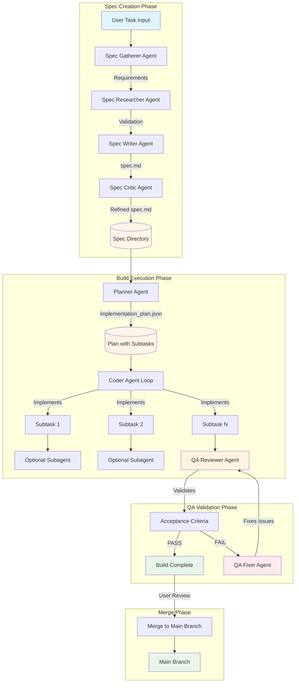
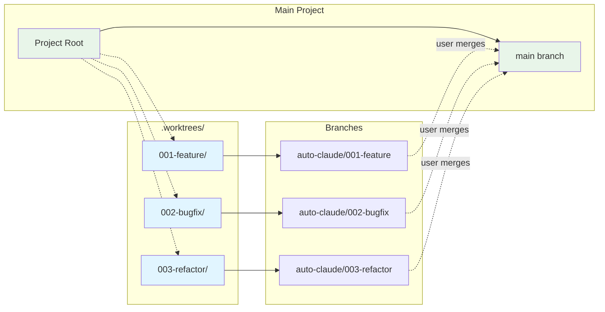
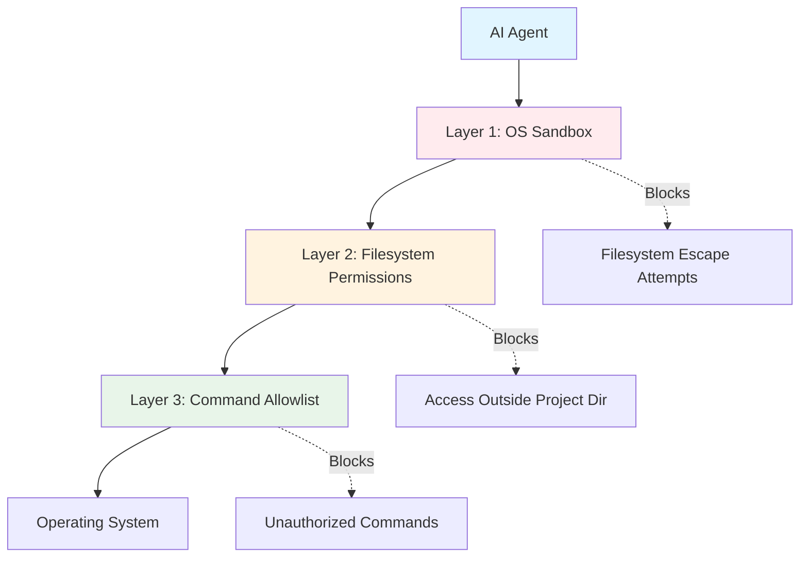
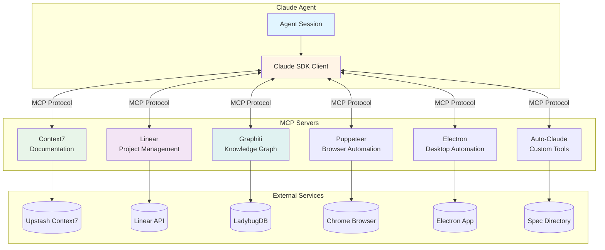

# Backend Architecture

This document explains the Auto-Claude backend architecture for developers. The backend is a Python-based autonomous coding framework that orchestrates multiple AI agents to build software through isolated, secure sessions.

## Overview

Auto-Claude's backend uses the **Claude Agent SDK** to run AI agents in isolated worktrees with multi-layered security controls. The system follows a multi-session build workflow where specialized agents handle different phases:

- **Planner Agent** - Creates implementation plans with subtasks
- **Coder Agent** - Implements individual subtasks (can spawn subagents for parallel work)
- **QA Reviewer** - Validates acceptance criteria
- **QA Fixer** - Resolves reported issues

Each agent runs in an isolated git worktree with restricted filesystem access and command allowlisting.

## Multi-Agent Pipeline Architecture



### Pipeline Stages Explained

#### 1. Spec Creation Phase
The spec creation pipeline is **dynamic** based on task complexity (SIMPLE/STANDARD/COMPLEX):

- **Gatherer Agent** (`spec_gatherer.md`) - Collects user requirements interactively or from task description
- **Researcher Agent** (`spec_researcher.md`) - Validates external integrations (APIs, libraries, etc.)
- **Writer Agent** (`spec_writer.md`) - Creates structured `spec.md` with acceptance criteria
- **Critic Agent** (`spec_critic.md`) - Self-critique using ultrathink (16K thinking tokens)

**Complexity Levels:**
- SIMPLE (3 phases): Discovery → Quick Spec → Validate
- STANDARD (6-7 phases): Full pipeline with optional Research
- COMPLEX (8 phases): Full pipeline with Research + Self-Critique

#### 2. Build Execution Phase
The coder agent implements subtasks **one at a time** but can spawn **subagents for parallel work** if needed:

- **Planner Agent** - Creates `implementation_plan.json` with subtasks grouped by phase
- **Coder Agent** - Main loop that:
  - Loads next subtask from plan
  - Reads pattern files and context
  - Implements the subtask
  - Commits changes to git
  - Updates subtask status to "completed"
  - Can spawn subagents (via Task tool) for parallel execution

**Subagent Spawning:**
The coder agent decides when to spawn subagents based on:
- Multiple independent subtasks that can run in parallel
- Complex tasks that benefit from specialized focus
- Research or exploration that can happen concurrently with implementation

#### 3. QA Validation Phase
Quality assurance loop ensures acceptance criteria are met:

- **QA Reviewer** - Validates all acceptance criteria from `spec.md`
- **QA Fixer** - Automatically fixes reported issues (loops until pass or max retries)
- QA agents have access to browser automation (Puppeteer/Electron MCP) for frontend testing

#### 4. Merge Phase
User reviews changes in isolated worktree, then merges to main branch:

- Changes are in `.worktrees/{spec-name}/` directory
- User runs `--merge` to merge spec branch → main
- User controls when to push to remote (no automatic pushes)

## Claude SDK Integration

Auto-Claude uses the **Claude Agent SDK** to run agents with security controls and tool permissions.

### Client Configuration

The `create_client()` function in `auto-claude/core/client.py` sets up the SDK client with:

**1. Multi-Layered Security:**
```python
security_settings = {
    "sandbox": {
        "enabled": True,              # OS-level bash isolation
        "autoAllowBashIfSandboxed": True
    },
    "permissions": {
        "defaultMode": "acceptEdits",  # Auto-approve edits in allowed dirs
        "allow": [
            "Read(./**)",              # Restricted to project directory
            "Write(./**)",
            "Edit(./**)",
            "Glob(./**)",
            "Grep(./**)",
            "Bash(*)",                 # Validated by security hook
            *MCP_TOOLS                 # Context-aware MCP tools
        ]
    }
}
```

**2. Agent-Specific Tools:**
Each agent type has different tool permissions:
- **Planner** - Core tools + auto-claude tools (build progress, memory)
- **Coder** - Core tools + auto-claude tools (subtask updates, discoveries)
- **QA Reviewer/Fixer** - Core tools + browser automation (Puppeteer/Electron MCP)

**3. MCP Server Integration:**
```python
mcp_servers = {
    "context7": {...},           # Documentation lookup (always enabled)
    "linear": {...},             # Project management (if LINEAR_API_KEY set)
    "graphiti-memory": {...},    # Knowledge graph (if GRAPHITI_MCP_URL set)
    "puppeteer": {...},          # Browser automation (QA agents, web frontends)
    "electron": {...},           # Desktop automation (QA agents, Electron apps)
    "auto-claude": {...}         # Custom tools (build progress, memory)
}
```

**4. Extended Thinking:**
Agents use different thinking budgets based on their role:
- **ultrathink (16K tokens)** - Spec creation (critic phase)
- **high (10K tokens)** - QA review
- **medium (5K tokens)** - Planning, validation
- **None (disabled)** - Coding (fast iteration)

### Security Hooks

The SDK client uses **pre-tool-use hooks** to validate bash commands:

```python
hooks = {
    "PreToolUse": [
        HookMatcher(matcher="Bash", hooks=[bash_security_hook])
    ]
}
```

The `bash_security_hook` in `auto-claude/core/security.py` validates every bash command against a **dynamic allowlist** generated from project analysis. This prevents unauthorized operations while allowing project-specific commands (npm, pytest, docker, etc.).

## Worktree Isolation Architecture

Auto-Claude uses **git worktrees** to isolate each build in a separate directory with its own branch.

### Why Worktrees?

Traditional git branches have issues for autonomous agents:
- Switching branches loses uncommitted work
- Conflicts when multiple tasks run in parallel
- Accidental commits to wrong branch
- Hard to review changes before merging

**Worktrees solve this:**
- Each spec gets its own directory (`.worktrees/{spec-name}/`)
- Each spec gets its own branch (`auto-claude/{spec-name}`)
- Agent works in isolated directory
- User reviews in worktree before merging
- Multiple specs can be built in parallel (future feature)

### Worktree Architecture



### Worktree Lifecycle

**1. Creation (`create_worktree`):**
```bash
# Creates worktree at .worktrees/{spec-name}/
# Creates branch auto-claude/{spec-name} from main
git worktree add -b auto-claude/{spec-name} .worktrees/{spec-name} main
```

**2. Build Execution:**
- Agent runs in worktree directory (restricted via SDK `cwd` option)
- All file operations are relative to worktree
- Commits are made to spec branch

**3. User Review (`--review`):**
```bash
cd .worktrees/{spec-name}/
# Test the changes
npm run dev
npm test
```

**4. Merge (`--merge`):**
```bash
# Merges spec branch into main (no-ff merge)
git checkout main
git merge --no-ff auto-claude/{spec-name}
```

**5. Cleanup (`--discard`):**
```bash
# Removes worktree and deletes branch
git worktree remove .worktrees/{spec-name}
git branch -D auto-claude/{spec-name}
```

### Implementation Details

The `WorktreeManager` class in `auto-claude/core/worktree.py` handles all worktree operations:

**Key Methods:**
- `create_worktree(spec_name)` - Create isolated worktree
- `get_worktree_info(spec_name)` - Get stats (commits, files changed, etc.)
- `merge_worktree(spec_name)` - Merge spec branch to main
- `remove_worktree(spec_name)` - Clean up worktree and branch
- `list_all_worktrees()` - List all active spec worktrees

**Features:**
- Automatic stale worktree cleanup
- Branch namespace conflict detection (prevents 'auto-claude' branch from blocking 'auto-claude/*')
- Gitignored file unstaging during merge
- Per-spec worktree statistics (commits, additions, deletions)

## Security Model

Auto-Claude implements **defense in depth** with three security layers.

### Security Layers



### Layer 1: OS Sandbox

The Claude SDK's sandbox mode runs bash commands in an **isolated subprocess** that prevents filesystem escape:

```python
"sandbox": {
    "enabled": True,
    "autoAllowBashIfSandboxed": True  # No manual approval needed
}
```

**What it blocks:**
- Escaping from project directory via `cd ../../../`
- Accessing sensitive system files (`/etc/passwd`, etc.)
- Running commands that affect the host system

### Layer 2: Filesystem Permissions

File operations are restricted to the project directory using **relative path patterns**:

```python
"permissions": {
    "allow": [
        "Read(./**)",    # Only ./** (relative paths in project dir)
        "Write(./**)",
        "Edit(./**)",
        "Glob(./**)",
        "Grep(./**)"
    ]
}
```

Combined with `cwd=str(project_dir.resolve())`, this ensures agents can only access files within their worktree.

**What it blocks:**
- Reading files outside project directory
- Writing to system directories
- Modifying files in other projects

### Layer 3: Command Allowlist

The `bash_security_hook` validates every bash command against a **dynamic allowlist** generated by analyzing the project:

**Dynamic Allowlisting Process:**
1. **Project Analysis** (`project_analyzer.py`) scans for:
   - `package.json` → npm, node, yarn commands allowed
   - `requirements.txt`/`pyproject.toml` → pip, python, pytest allowed
   - `Cargo.toml` → cargo, rustc allowed
   - `Dockerfile` → docker commands allowed
   - `.github/` → gh (GitHub CLI) allowed

2. **Security Profile** cached in `.auto-claude-security.json`:
```json
{
  "allowed_commands": ["git", "npm", "pytest", "docker"],
  "detected_stack": ["nodejs", "python", "docker"],
  "scan_time": "2024-01-14T10:30:00Z"
}
```

3. **Runtime Validation** checks each bash command:
   - Extract base command (`npm` from `npm install`)
   - Check against allowlist
   - Block if not allowed (agent must use alternative)

**What it blocks:**
- Destructive commands (`rm -rf /`, `sudo`, etc.)
- Network commands not related to project (`curl` to download malware)
- System administration commands
- Commands not detected in project stack

**Allowed Commands (Base Set):**
- **Git operations:** `git`, `gh` (GitHub CLI if detected)
- **File operations:** `ls`, `cat`, `head`, `tail`, `find`, `wc`
- **Text processing:** `grep`, `sed`, `awk`
- **Utilities:** `echo`, `printf`, `mkdir`, `cp`, `mv`, `rm`

**Project-Specific Commands (Dynamic):**
- Detected from project stack (npm, pip, docker, cargo, go, etc.)
- Only enabled if corresponding files found in project

### Security Best Practices

**DO:**
- Keep sandbox mode enabled (never disable)
- Use relative paths (`./**`) in permissions
- Regularly review `.auto-claude-security.json`
- Run builds in worktrees (not main project)

**DON'T:**
- Disable sandbox mode for convenience
- Add broad wildcard patterns to permissions (`*`, `/**`)
- Manually edit security profile (regenerate instead)
- Commit `.claude_settings.json` (generated per-run)

## MCP Server Integration Patterns

Auto-Claude uses the **Model Context Protocol (MCP)** to extend agents with external capabilities.

### MCP Architecture



### Available MCP Servers

#### 1. Context7 (Always Enabled)
**Purpose:** Documentation lookup for any library or framework

**Tools:**
- `mcp__context7__resolve-library-id` - Find library ID by name
- `mcp__context7__query-docs` - Query documentation with semantic search

**Usage Pattern:**
```typescript
// Agent uses Context7 to look up React documentation
const libraryId = await resolve_library_id("react", "How to use hooks?");
const docs = await query_docs(libraryId, "useState hook examples");
```

**Configuration:**
```python
mcp_servers["context7"] = {
    "command": "npx",
    "args": ["-y", "@upstash/context7-mcp"]
}
```

#### 2. Linear (Optional, Requires `LINEAR_API_KEY`)
**Purpose:** Project management integration for progress tracking

**Tools:**
- `mcp__linear-server__list_issues` - List Linear issues
- `mcp__linear-server__update_issue` - Update issue status
- `mcp__linear-server__create_comment` - Add comments to issues

**Usage Pattern:**
```python
# Auto-update Linear issue when build completes
if is_linear_enabled():
    await update_issue(
        issue_id=spec_linear_id,
        status="Done",
        comment="Build completed successfully"
    )
```

**Configuration:**
```python
mcp_servers["linear"] = {
    "type": "http",
    "url": "https://mcp.linear.app/mcp",
    "headers": {"Authorization": f"Bearer {LINEAR_API_KEY}"}
}
```

#### 3. Graphiti Memory (Optional, Requires `GRAPHITI_MCP_URL`)
**Purpose:** Knowledge graph for cross-session context retrieval

**Tools:**
- `mcp__graphiti-memory__search_nodes` - Search entity summaries
- `mcp__graphiti-memory__search_facts` - Search relationships
- `mcp__graphiti-memory__add_episode` - Add data to knowledge graph

**Usage Pattern:**
```python
# Store discovered pattern for future sessions
await add_episode(
    content="Auth system uses JWT tokens stored in httpOnly cookies",
    entity_types=["authentication", "security"]
)

# Retrieve relevant context in future session
facts = await search_facts("authentication patterns")
```

**Configuration:**
```python
mcp_servers["graphiti-memory"] = {
    "type": "http",
    "url": os.environ.get("GRAPHITI_MCP_URL", "http://localhost:8000/mcp/")
}
```

**Note:** Requires Docker container:
```bash
docker run -d -p 8000:8000 falkordb/graphiti-knowledge-graph-mcp
```

#### 4. Puppeteer (QA Agents, Web Frontends)
**Purpose:** Browser automation for testing web applications

**Enabled When:**
- Agent type is `qa_reviewer` or `qa_fixer`
- Project has web frontend (detected via `package.json` + `src/` or `public/`)
- Project is NOT Electron app

**Tools:**
- `mcp__puppeteer__puppeteer_connect_active_tab` - Connect to browser
- `mcp__puppeteer__puppeteer_navigate` - Navigate to URL
- `mcp__puppeteer__puppeteer_screenshot` - Take screenshot
- `mcp__puppeteer__puppeteer_click` - Click element
- `mcp__puppeteer__puppeteer_fill` - Fill form input

**Usage Pattern:**
```python
# QA agent tests login flow
await puppeteer_navigate("http://localhost:3000/login")
await puppeteer_fill("input[name='email']", "test@example.com")
await puppeteer_fill("input[name='password']", "password123")
await puppeteer_click("button[type='submit']")
screenshot = await puppeteer_screenshot()  # Verify login success
```

**Configuration:**
```python
mcp_servers["puppeteer"] = {
    "command": "npx",
    "args": ["puppeteer-mcp-server"]
}
```

**Screenshot Compression:** Screenshots are compressed (1280x720, quality 60, JPEG) to stay under Claude SDK's 1MB JSON message buffer limit.

#### 5. Electron (QA Agents, Electron Apps)
**Purpose:** Desktop automation for testing Electron applications

**Enabled When:**
- Agent type is `qa_reviewer` or `qa_fixer`
- Project has Electron (detected via `electron` in `package.json`)
- `ELECTRON_MCP_ENABLED=true` in environment
- Electron app started with `--remote-debugging-port=9222`

**Tools:**
- `mcp__electron__get_electron_window_info` - Get window info
- `mcp__electron__take_screenshot` - Capture screenshot
- `mcp__electron__send_command_to_electron` - Send commands (click, fill, evaluate JS)
- `mcp__electron__read_electron_logs` - Read console logs

**Usage Pattern:**
```python
# QA agent tests Electron app
windows = await get_electron_window_info()
screenshot = await take_screenshot(window_id=windows[0]["id"])
await send_command_to_electron({
    "action": "click",
    "selector": "#create-task-button"
})
```

**Configuration:**
```python
mcp_servers["electron"] = {
    "command": "npm",
    "args": ["exec", "electron-mcp-server"]
}
```

**Debug Port:** Configurable via `ELECTRON_DEBUG_PORT` (default: 9222)

#### 6. Auto-Claude Tools (Agent-Specific)
**Purpose:** Custom tools for build progress, memory, and subtask management

**Enabled When:** `auto-claude-tools` package is installed

**Tools by Agent Type:**

**Planner Agent:**
- `mcp__auto-claude__get_build_progress` - Get current plan status
- `mcp__auto-claude__record_discovery` - Record codebase insights

**Coder Agent:**
- `mcp__auto-claude__update_subtask_status` - Mark subtask complete
- `mcp__auto-claude__record_discovery` - Record patterns found
- `mcp__auto-claude__record_gotcha` - Record pitfalls to avoid

**QA Agents:**
- `mcp__auto-claude__update_qa_status` - Update QA report
- `mcp__auto-claude__get_session_context` - Retrieve session memory

**Configuration:**
```python
auto_claude_mcp_server = create_auto_claude_mcp_server(spec_dir, project_dir)
mcp_servers["auto-claude"] = auto_claude_mcp_server
```

### Dynamic MCP Tool Selection

Auto-Claude uses **project capability detection** to only include relevant MCP tools:

**Detection Process:**
1. Build project index (scan files, dependencies, configs)
2. Detect capabilities:
   ```python
   {
       "is_electron": bool,        # Electron app
       "is_web_frontend": bool,    # Web frontend (React, Vue, etc.)
       "has_backend_api": bool,    # REST/GraphQL API
       "has_database": bool        # Database (Prisma, SQLAlchemy, etc.)
   }
   ```
3. Filter MCP tools based on capabilities:
   - **Electron app** → Electron MCP tools (not Puppeteer)
   - **Web frontend** → Puppeteer MCP tools (not Electron)
   - **No frontend** → No browser automation tools

**Benefits:**
- Saves context window (only relevant tools loaded)
- Prevents tool misuse (can't use Puppeteer on Electron app)
- Adapts to project type automatically

### MCP Best Practices

**DO:**
- Use Context7 for documentation lookup (always available)
- Enable Linear integration for project tracking (optional but recommended)
- Use Puppeteer for web app QA testing
- Use Electron MCP for desktop app QA testing
- Compress screenshots before sending to agent

**DON'T:**
- Run multiple MCP servers on same port
- Disable MCP tools that agents rely on (Context7)
- Mix Puppeteer and Electron automation (use one based on project type)
- Forget to start Electron app with debug port for testing

## Key Implementation Files

| File | Purpose |
|------|---------|
| `auto-claude/core/client.py` | Claude SDK client configuration, MCP server setup, security settings |
| `auto-claude/core/security.py` | Bash command validation, security hooks |
| `auto-claude/core/worktree.py` | Git worktree management, isolation |
| `auto-claude/core/auth.py` | OAuth token management |
| `auto-claude/agents/planner.py` | Planner agent loop |
| `auto-claude/agents/coder.py` | Coder agent loop, subagent spawning |
| `auto-claude/agents/qa_reviewer.py` | QA validation loop |
| `auto-claude/agents/qa_fixer.py` | QA fix loop |
| `auto-claude/spec_agents/` | Spec creation agents (gatherer, researcher, writer, critic) |
| `auto-claude/project_analyzer.py` | Project capability detection for security allowlist |
| `auto-claude/prompts_pkg/project_context.py` | Project capability detection for MCP tool selection |

## Related Documentation

- [Backend Overview](./README.md) - Backend tech stack and folder structure
- [Agent System](./agents.md) - Detailed agent workflows and prompts
- [Memory System](./memory.md) - Graphiti integration and session context
- [Security Model](./security.md) - In-depth security documentation
- [Integrations](./integrations.md) - Linear, GitHub, and MCP integrations
