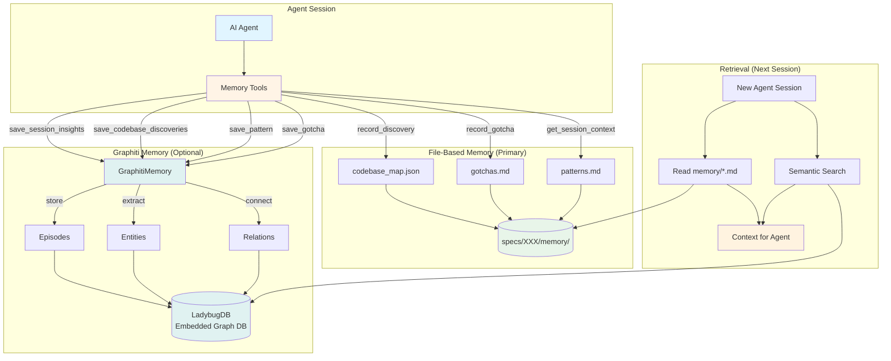
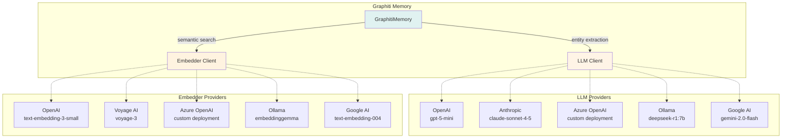

# Memory System

This document explains Auto-Claude's **dual-layer memory architecture** for developers. The memory system enables AI agents to learn from past sessions and maintain context across builds.

## Overview

Auto-Claude uses a **two-tier memory system** that balances simplicity with power:

1. **File-Based Memory (Primary)** - Always available, zero dependencies, human-readable
2. **Graphiti Memory (Optional)** - Graph-based knowledge store with semantic search

Both layers work together to give agents:
- **Session continuity** - Remember discoveries from previous builds
- **Pattern recognition** - Learn from past successes and failures
- **Context retrieval** - Find relevant information across all sessions
- **Codebase mapping** - Build understanding of project structure

## Architecture Diagram



## File-Based Memory (Primary Layer)

The **file-based memory** is the foundation of Auto-Claude's memory system. It's simple, reliable, and always available.

### Why File-Based Memory?

**Pros:**
- ✅ **Zero dependencies** - No external services or databases required
- ✅ **Human-readable** - Developers can inspect and edit memory files directly
- ✅ **Git-trackable** - Memory files are versioned with the spec
- ✅ **Fast** - No network calls or database queries
- ✅ **Debuggable** - Easy to see what agents learned

**Cons:**
- ❌ Limited search capabilities (keyword-based only)
- ❌ No semantic understanding
- ❌ Manual organization required

### File Structure

Each spec maintains its own memory directory:

```
specs/001-add-auth/
├── memory/
│   ├── codebase_map.json     # Discovered files and their purposes
│   ├── gotchas.md             # Pitfalls and warnings
│   ├── patterns.md            # Code patterns to follow
│   └── session_insights.md    # Session summaries
```

### Memory Tools (MCP)

File-based memory is accessed via **auto-claude MCP tools**:

#### 1. `record_discovery`

Records important files and their purposes to the codebase map.

```python
@tool("record_discovery", "Record a codebase discovery to session memory.")
async def record_discovery(args: dict[str, Any]) -> dict[str, Any]:
    """
    Args:
        file_path: Path to the discovered file
        description: What this file does
        category: Type of file (auth, api, ui, etc.)
    """
    # Stores in memory/codebase_map.json
    codebase_map["discovered_files"][file_path] = {
        "description": description,
        "category": category,
        "discovered_at": datetime.now(timezone.utc).isoformat()
    }
```

**Usage Example:**
```python
# Agent discovers auth middleware during exploration
await record_discovery({
    "file_path": "src/middleware/auth.ts",
    "description": "JWT token validation middleware for protected routes",
    "category": "authentication"
})
```

**Output (`codebase_map.json`):**
```json
{
  "discovered_files": {
    "src/middleware/auth.ts": {
      "description": "JWT token validation middleware for protected routes",
      "category": "authentication",
      "discovered_at": "2024-01-14T10:30:00Z"
    }
  }
}
```

#### 2. `record_gotcha`

Records pitfalls, bugs, or warnings for future sessions.

```python
@tool("record_gotcha", "Record a gotcha or pitfall to avoid.")
async def record_gotcha(args: dict[str, Any]) -> dict[str, Any]:
    """
    Args:
        gotcha: The warning or pitfall
        context: Additional context about when/why it matters
    """
    # Appends to memory/gotchas.md
    entry = f"\n## [{timestamp}]\n{gotcha}\n\n_Context: {context}_\n"
```

**Usage Example:**
```python
# Agent encounters tricky async behavior
await record_gotcha({
    "gotcha": "Database queries must use `await` or they silently fail",
    "context": "Found this when tests were passing but data wasn't saving"
})
```

**Output (`gotchas.md`):**
```markdown
# Gotchas & Pitfalls

## [2024-01-14 10:30]
Database queries must use `await` or they silently fail

_Context: Found this when tests were passing but data wasn't saving_
```

#### 3. `get_session_context`

Retrieves accumulated context from previous sessions.

```python
@tool("get_session_context", "Get context from previous sessions.")
async def get_session_context(args: dict[str, Any]) -> dict[str, Any]:
    """
    Returns:
        Markdown-formatted context including:
        - Codebase discoveries (last 20)
        - Recent gotchas (last 1000 chars)
        - Code patterns (last 1000 chars)
    """
```

**Usage Example:**
```python
# New coder agent starts working on a spec
context = await get_session_context({})

# Returns:
"""
## Codebase Discoveries
- `src/middleware/auth.ts`: JWT token validation middleware
- `src/utils/crypto.ts`: Password hashing utilities
...

## Gotchas
- Database queries must use `await` or they silently fail
...

## Patterns
- All API routes use `validateRequest` middleware
...
"""
```

### Implementation Details

File-based memory is implemented in `auto-claude/agents/tools_pkg/tools/memory.py`:

**Key Functions:**
- `create_memory_tools(spec_dir, project_dir)` - Factory for MCP tools
- `record_discovery` - Write to codebase map
- `record_gotcha` - Append to gotchas file
- `get_session_context` - Read and format all memory files

**Memory Directory Creation:**
```python
memory_dir = spec_dir / "memory"
memory_dir.mkdir(exist_ok=True)  # Auto-created on first use
```

## Graphiti Memory (Enhanced Layer)

The **Graphiti memory layer** adds semantic search and knowledge graph capabilities on top of file-based memory.

### What is a Knowledge Graph?

Think of a knowledge graph as a **network of connected facts** about your project:

**Traditional Storage (Files):**
```
auth.ts contains JWT middleware
crypto.ts contains password hashing
auth.ts uses crypto.ts
```

**Knowledge Graph (Graphiti):**
```
┌─────────────┐
│   auth.ts   │────uses────▶│ crypto.ts │
└─────────────┘              └───────────┘
      │
      │ contains
      ▼
┌──────────────────┐
│ JWT middleware   │
└──────────────────┘
      │
      │ validates
      ▼
┌──────────────────┐
│  user tokens     │
└──────────────────┘
```

The graph understands **relationships** between concepts, not just keywords. This enables:

- **Semantic search** - "How does authentication work?" finds JWT middleware even without keyword "JWT"
- **Contextual retrieval** - Get connected facts (what uses auth? what does auth use?)
- **Pattern detection** - Discover patterns across multiple sessions

### LadybugDB: Embedded Graph Database

Graphiti uses **LadybugDB** as its storage backend:

**Why LadybugDB?**
- ✅ **Embedded** - Runs in-process, no Docker/server required
- ✅ **Zero-config** - Just install Python package and go
- ✅ **Graph-native** - Built for storing nodes and relationships
- ✅ **Python 3.12+** - Requires recent Python (uses modern async features)

**Storage Location:**
```
~/.auto-claude/
└── memories/
    └── auto_claude_memory_openai_1536/  # Database name (provider-specific)
        ├── nodes.db                      # Graph nodes (entities)
        ├── edges.db                      # Graph edges (relationships)
        └── embeddings.db                 # Vector embeddings for search
```

**Installation:**
```bash
# Requires Python 3.12+
pip install real_ladybug graphiti-core
```

### Multi-Provider Architecture

Graphiti supports **multiple LLM and embedding providers** for flexibility and cost optimization.

#### Provider Overview



#### Provider Factory Pattern

The multi-provider system uses a **factory pattern** to create LLM and embedder clients based on configuration:

**Implementation (`auto-claude/integrations/graphiti/providers_pkg/factory.py`):**

```python
def create_llm_client(config: GraphitiConfig):
    """
    Create LLM client based on config.llm_provider.

    Supports: openai, anthropic, azure_openai, ollama, google
    """
    if config.llm_provider == "openai":
        return OpenAILLMClient(api_key=config.openai_api_key, model=config.openai_model)
    elif config.llm_provider == "anthropic":
        return AnthropicLLMClient(api_key=config.anthropic_api_key, model=config.anthropic_model)
    # ... other providers

def create_embedder(config: GraphitiConfig):
    """
    Create embedder client based on config.embedder_provider.

    Supports: openai, voyage, azure_openai, ollama, google
    """
    if config.embedder_provider == "openai":
        return OpenAIEmbedder(api_key=config.openai_api_key, model=config.openai_embedding_model)
    elif config.embedder_provider == "voyage":
        return VoyageEmbedder(api_key=config.voyage_api_key, model=config.voyage_embedding_model)
    # ... other providers
```

### Configuration

Graphiti memory is configured via **environment variables**:

#### Core Settings

```bash
# Enable/disable Graphiti
GRAPHITI_ENABLED=true

# Provider selection
GRAPHITI_LLM_PROVIDER=openai           # openai|anthropic|azure_openai|ollama|google
GRAPHITI_EMBEDDER_PROVIDER=openai      # openai|voyage|azure_openai|ollama|google

# Database
GRAPHITI_DATABASE=auto_claude_memory   # Database name
GRAPHITI_DB_PATH=~/.auto-claude/memories  # Storage location
```

#### Provider-Specific Configuration

**OpenAI (Recommended for Production):**
```bash
OPENAI_API_KEY=sk-...
OPENAI_MODEL=gpt-5-mini                      # LLM for entity extraction
OPENAI_EMBEDDING_MODEL=text-embedding-3-small # 1536 dimensions
```

**Anthropic + Voyage (High Quality):**
```bash
# Anthropic for LLM (Claude)
GRAPHITI_LLM_PROVIDER=anthropic
ANTHROPIC_API_KEY=sk-ant-...
GRAPHITI_ANTHROPIC_MODEL=claude-sonnet-4-5

# Voyage for embeddings (commonly paired with Anthropic)
GRAPHITI_EMBEDDER_PROVIDER=voyage
VOYAGE_API_KEY=pa-...
VOYAGE_EMBEDDING_MODEL=voyage-3  # 1024 dimensions
```

**Azure OpenAI (Enterprise):**
```bash
GRAPHITI_LLM_PROVIDER=azure_openai
GRAPHITI_EMBEDDER_PROVIDER=azure_openai

AZURE_OPENAI_API_KEY=...
AZURE_OPENAI_BASE_URL=https://your-resource.openai.azure.com
AZURE_OPENAI_LLM_DEPLOYMENT=gpt-4-deployment-name
AZURE_OPENAI_EMBEDDING_DEPLOYMENT=embedding-deployment-name
```

**Ollama (Local/Offline):**
```bash
GRAPHITI_LLM_PROVIDER=ollama
GRAPHITI_EMBEDDER_PROVIDER=ollama

OLLAMA_BASE_URL=http://localhost:11434
OLLAMA_LLM_MODEL=deepseek-r1:7b
OLLAMA_EMBEDDING_MODEL=embeddinggemma  # 768 dimensions (auto-detected)
# OLLAMA_EMBEDDING_DIM=768  # Optional override
```

**Supported Ollama Embedding Models (with auto-detected dimensions):**
- `embeddinggemma` - 768 dim (recommended, lightweight)
- `qwen3-embedding:0.6b` - 1024 dim
- `qwen3-embedding:4b` - 2560 dim
- `qwen3-embedding:8b` - 4096 dim
- `nomic-embed-text` - 768 dim
- `mxbai-embed-large` - 1024 dim
- `bge-large` - 1024 dim

**Google AI (Gemini):**
```bash
GRAPHITI_LLM_PROVIDER=google
GRAPHITI_EMBEDDER_PROVIDER=google

GOOGLE_API_KEY=AIza...
GOOGLE_LLM_MODEL=gemini-2.0-flash
GOOGLE_EMBEDDING_MODEL=text-embedding-004  # 768 dimensions
```

### Provider-Specific Databases

To prevent **embedding dimension mismatches**, Graphiti creates separate databases for each provider:

```python
# OpenAI (1536 dim)
database = "auto_claude_memory_openai_1536"

# Voyage (1024 dim)
database = "auto_claude_memory_voyage_1024"

# Ollama embeddinggemma (768 dim)
database = "auto_claude_memory_ollama_embeddinggemma_768"
```

**Why?** Mixing embeddings with different dimensions causes errors. Provider-specific databases ensure compatibility.

**Migration:** If you change providers, run:
```bash
python auto-claude/integrations/graphiti/migrate_embeddings.py
```

### Session Context Management

Graphiti provides two **memory scoping modes** for session context:

#### Spec Mode (Default)

Each spec gets **isolated memory** - sessions don't share context.

```python
group_id_mode = GroupIdMode.SPEC  # Default

# Spec 001 group_id: "001-add-auth"
# Spec 002 group_id: "002-refactor-api"
# Memories are isolated per spec
```

**When to use:**
- Most use cases (default)
- Specs are independent features
- Want clean separation between tasks

#### Project Mode (Shared Context)

All specs in a project **share memory** - sessions learn from each other.

```python
group_id_mode = GroupIdMode.PROJECT

# All specs share group_id: "project_auto-claude_a1b2c3d4"
# Memories are shared across specs
```

**When to use:**
- Related specs that build on each other
- Want agents to learn patterns across features
- Working on same codebase across multiple specs

**Configuration:**
```python
# In agent.py or custom runner
memory = GraphitiMemory(
    spec_dir=spec_dir,
    project_dir=project_dir,
    group_id_mode=GroupIdMode.PROJECT  # or GroupIdMode.SPEC
)
```

### Memory Operations

Graphiti memory exposes async methods for storing and retrieving context:

#### Storing Context

```python
from auto-claude.integrations.graphiti.memory import get_graphiti_memory

# Initialize memory
memory = get_graphiti_memory(spec_dir, project_dir)
await memory.initialize()

# Save session insights
await memory.save_session_insights(
    session_num=1,
    insights={
        "task": "Implemented user authentication",
        "approach": "Used JWT tokens with httpOnly cookies",
        "challenges": "Had to handle token refresh logic",
        "outcome": "All tests passing, secure auth flow"
    }
)

# Save codebase discoveries
await memory.save_codebase_discoveries({
    "src/middleware/auth.ts": "JWT token validation middleware",
    "src/utils/crypto.ts": "Password hashing with bcrypt",
    "src/routes/auth.ts": "Login/logout endpoints"
})

# Save code pattern
await memory.save_pattern(
    "All API routes use validateRequest middleware before handlers"
)

# Save gotcha
await memory.save_gotcha(
    "Database queries must use `await` or they silently fail"
)

# Save task outcome (for learning)
await memory.save_task_outcome(
    task_id="subtask-1-2",
    success=True,
    outcome="Implemented JWT middleware successfully",
    metadata={"files_changed": 3, "tests_added": 5}
)
```

#### Retrieving Context

```python
# Search for relevant context
context = await memory.get_relevant_context(
    query="How does authentication work in this project?",
    num_results=5,
    include_project_context=True  # Include project-wide context in PROJECT mode
)

# Returns list of relevant episodes:
[
    {
        "content": "JWT token validation middleware in src/middleware/auth.ts",
        "episode_type": "codebase_discovery",
        "created_at": "2024-01-14T10:30:00Z"
    },
    {
        "content": "All API routes use validateRequest middleware",
        "episode_type": "pattern",
        "created_at": "2024-01-14T11:00:00Z"
    },
    ...
]

# Get session history
history = await memory.get_session_history(
    limit=5,
    spec_only=True  # Only this spec (SPEC mode) or all specs (PROJECT mode)
)

# Find similar task outcomes
similar_tasks = await memory.get_similar_task_outcomes(
    task_description="Implement user authentication",
    limit=5
)
```

### Graphiti Implementation Details

The Graphiti integration is **modularized** into specialized components:

**Core Files:**

| File | Purpose |
|------|---------|
| `memory.py` | High-level GraphitiMemory facade |
| `queries_pkg/graphiti.py` | Main GraphitiMemory class (session management) |
| `queries_pkg/client.py` | LadybugDB client wrapper (connection lifecycle) |
| `queries_pkg/queries.py` | Episode storage operations (add insights, discoveries) |
| `queries_pkg/search.py` | Semantic search logic (get_relevant_context) |
| `queries_pkg/schema.py` | Data structures and constants (episode types, group modes) |

**Provider System:**

| File | Purpose |
|------|---------|
| `providers.py` | Provider facade (backward compatibility) |
| `providers_pkg/factory.py` | Factory functions (create_llm_client, create_embedder) |
| `providers_pkg/llm_providers/*.py` | LLM implementations (OpenAI, Anthropic, Azure, Ollama, Google) |
| `providers_pkg/embedder_providers/*.py` | Embedder implementations (OpenAI, Voyage, Azure, Ollama, Google) |
| `providers_pkg/models.py` | Embedding dimensions and constants |
| `providers_pkg/validators.py` | Configuration validation and health checks |

**Configuration:**

| File | Purpose |
|------|---------|
| `config.py` | GraphitiConfig dataclass, environment variable parsing, provider selection |

### Episode Types

Graphiti stores different types of context as **episodes** (discrete memory units):

```python
# Episode types (from schema.py)
EPISODE_TYPE_SESSION_INSIGHT = "session_insight"          # Session summaries
EPISODE_TYPE_CODEBASE_DISCOVERY = "codebase_discovery"    # File discoveries
EPISODE_TYPE_PATTERN = "pattern"                          # Code patterns
EPISODE_TYPE_GOTCHA = "gotcha"                            # Pitfalls/warnings
EPISODE_TYPE_TASK_OUTCOME = "task_outcome"                # Task results
EPISODE_TYPE_QA_RESULT = "qa_result"                      # QA validation results
EPISODE_TYPE_HISTORICAL_CONTEXT = "historical_context"    # Cross-session context
```

Each episode type enables specialized search:
- Search for **gotchas** when starting risky operations
- Search for **patterns** when implementing new features
- Search for **task outcomes** to learn from past successes/failures

### Memory Lifecycle

**Initialization:**
```python
# 1. Create memory instance
memory = GraphitiMemory(spec_dir, project_dir)

# 2. Initialize LadybugDB client and build indices
success = await memory.initialize()

# 3. Check status
if memory.is_initialized:
    status = memory.get_status_summary()
    # {
    #   "enabled": True,
    #   "database": "auto_claude_memory_openai_1536",
    #   "episode_count": 42,
    #   "llm_provider": "openai",
    #   "embedder_provider": "openai"
    # }
```

**Usage in Agent:**
```python
# Agent loop (planner, coder, qa)
async def run_agent():
    memory = get_graphiti_memory(spec_dir, project_dir)
    await memory.initialize()

    # Get context at start
    context = await memory.get_relevant_context("What did we learn about auth?")

    # ... do work ...

    # Save discoveries during work
    await memory.save_codebase_discoveries({...})

    # Save insights at end
    await memory.save_session_insights(session_num=1, insights={...})

    # Clean up
    await memory.close()
```

**State Tracking:**
Each spec maintains a `.graphiti_state.json` file:
```json
{
  "initialized": true,
  "database": "auto_claude_memory_openai_1536",
  "indices_built": true,
  "created_at": "2024-01-14T10:00:00Z",
  "last_session": 3,
  "episode_count": 42,
  "llm_provider": "openai",
  "embedder_provider": "openai",
  "error_log": []
}
```

### Error Handling and Fallbacks

Graphiti is **gracefully degradable** - if it fails, agents fall back to file-based memory:

```python
# Memory operations are always safe
async def save_discovery(discovery):
    # Try Graphiti first
    if await memory.save_codebase_discoveries(discovery):
        logger.info("Saved to Graphiti")
    else:
        # Fallback to file-based memory
        logger.warning("Graphiti unavailable, using file-based memory")
        await file_memory.record_discovery(discovery)
```

**Error Scenarios:**
- LadybugDB not installed → File-based memory only
- Invalid API keys → Warning logged, file-based memory used
- Network errors → Retry with exponential backoff, then fallback
- Provider dimension mismatch → Warning with migration instructions

## Best Practices

### When to Use Each Layer

**Use File-Based Memory:**
- ✅ Quick notes and gotchas
- ✅ Human-readable patterns
- ✅ Session summaries
- ✅ Small projects (< 10 specs)

**Use Graphiti Memory:**
- ✅ Large projects (10+ specs)
- ✅ Complex codebases with many patterns
- ✅ Cross-session learning required
- ✅ Semantic search needed ("How does X work?")

**Use Both:**
- ✅ File-based for quick reference
- ✅ Graphiti for deep context retrieval
- ✅ Best of both worlds (default configuration)

### Memory Recording Guidelines

**DO:**
- Record **why** decisions were made, not just what changed
- Save **patterns** that should be followed in future code
- Record **gotchas** immediately when discovered
- Use **specific descriptions** ("JWT middleware validates token signature") not vague ("auth stuff")

**DON'T:**
- Record obvious information ("server.ts is the server file")
- Save sensitive data (API keys, passwords, credentials)
- Duplicate information across sessions (check existing context first)
- Record too much detail (focus on learnings, not implementation minutiae)

### Configuration Tips

**Choosing Providers:**

| Use Case | LLM Provider | Embedder Provider | Why |
|----------|--------------|-------------------|-----|
| Production | OpenAI | OpenAI | Best quality, reliable, fast |
| High Quality | Anthropic | Voyage | Claude for extraction, Voyage optimized for search |
| Enterprise | Azure OpenAI | Azure OpenAI | Compliance, data residency |
| Local/Offline | Ollama | Ollama | No external API, privacy |
| Cost-Optimized | Google AI | Google AI | Gemini Flash is very affordable |

**Embedding Dimensions:**
- Higher dimensions = better quality, slower search, more storage
- 768 dim (Google, Ollama embeddinggemma) - Good for most use cases
- 1024 dim (Voyage) - Balanced quality and performance
- 1536 dim (OpenAI) - High quality, industry standard

### Debugging Memory Issues

**Check memory status:**
```python
status = memory.get_status_summary()
print(status)
# {
#   "enabled": True,
#   "initialized": True,
#   "episode_count": 42,
#   "errors": 0
# }
```

**Test connection:**
```python
from auto-claude.integrations.graphiti.memory import test_graphiti_connection

success, message = await test_graphiti_connection()
print(f"Graphiti: {message}")
# "Connected to LadybugDB (providers: LLM: openai, Embedder: openai)"
```

**Inspect state:**
```bash
# View state file
cat .auto-claude/specs/001-feature/.graphiti_state.json

# View file-based memory
cat .auto-claude/specs/001-feature/memory/codebase_map.json
cat .auto-claude/specs/001-feature/memory/gotchas.md
```

**Reset Graphiti:**
```bash
# Remove state file (forces re-initialization)
rm .auto-claude/specs/001-feature/.graphiti_state.json

# Or delete database entirely
rm -rf ~/.auto-claude/memories/auto_claude_memory_*
```

## Related Documentation

- [Backend Overview](./README.md) - Backend tech stack and folder structure
- [Architecture](./architecture.md) - Multi-agent pipeline and Claude SDK integration
- [Agent System](./agents.md) - How agents use memory during builds
- [Integrations](./integrations.md) - Linear, GitHub, and other integrations
