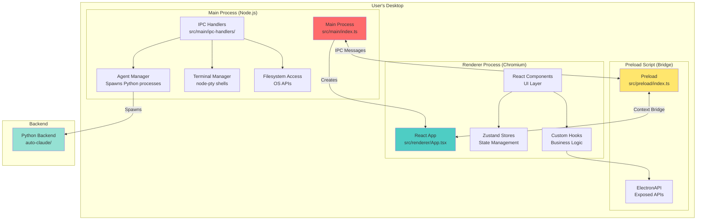

# Frontend Architecture

This document provides an in-depth look at Auto Claude's frontend architecture, covering the Electron process model, React component architecture, Vite build system, and communication patterns.

**Target Audience:** Developers who need to understand how the frontend is architected to make informed design and implementation decisions.

**What You'll Learn:**
- How Electron's multi-process architecture isolates security concerns
- How the main, renderer, and preload processes communicate
- React component architecture and organization patterns
- Vite build system configuration and optimization
- Routing and navigation patterns in the application

---

## 🏗️ Electron Multi-Process Architecture

Electron applications run in multiple isolated processes for security and stability. Auto Claude uses a **three-process model**:



### 1. Main Process (`src/main/`)

**Environment:** Node.js
**Entry Point:** `src/main/index.ts`
**Capabilities:** Full OS access, privileged operations

The **main process** is the "backend" of the Electron app. It has unrestricted access to:
- Filesystem (read/write files, create directories)
- Operating system APIs (system dialogs, tray icons, notifications)
- Network (HTTP requests, websockets)
- Child processes (spawn Python agents, terminal shells)

**Key Responsibilities:**
- **Window Management** - Creates and manages BrowserWindow instances
- **IPC Communication** - Handles requests from renderer via `ipcMain.handle()`
- **Python Integration** - Spawns and manages Python backend processes
- **Terminal Management** - Creates pseudo-terminals using `node-pty`
- **File Watching** - Monitors project files for changes using `chokidar`
- **Auto-Updates** - Checks for and installs app updates

**Code Example:**
```typescript
// src/main/index.ts
import { app, BrowserWindow } from 'electron';

function createWindow(): void {
  const mainWindow = new BrowserWindow({
    width: 1400,
    height: 900,
    webPreferences: {
      preload: join(__dirname, '../preload/index.js'),
      sandbox: false,           // Disable sandbox for node-pty
      contextIsolation: true,   // Enable context isolation for security
      nodeIntegration: false    // Disable direct Node.js access from renderer
    }
  });

  mainWindow.loadURL('http://localhost:5173'); // Dev server
}

app.whenReady().then(createWindow);
```

### 2. Renderer Process (`src/renderer/`)

**Environment:** Chromium (Browser)
**Entry Point:** `src/renderer/main.tsx`
**Capabilities:** Limited - sandboxed browser environment

The **renderer process** is the "frontend" - a React application running in Chromium. For security, it's **sandboxed** and cannot directly access:
- Filesystem
- Operating system APIs
- Node.js modules (unless explicitly bridged)

**Key Responsibilities:**
- **UI Rendering** - React components and DOM manipulation
- **User Interaction** - Handling clicks, keyboard input, drag-and-drop
- **State Management** - Zustand stores for application state
- **IPC Communication** - Calls main process via `window.electronAPI`

**Security Model:**
- `nodeIntegration: false` - Prevents direct `require()` of Node.js modules
- `contextIsolation: true` - Isolates renderer JavaScript from preload context
- All privileged operations must go through IPC to main process

**Code Example:**
```typescript
// src/renderer/App.tsx
import { useState, useEffect } from 'react';

export function App() {
  const [pythonPath, setPythonPath] = useState('');

  useEffect(() => {
    // Call main process via preload bridge
    window.electronAPI.getPythonPath().then(setPythonPath);
  }, []);

  return <div>Python: {pythonPath}</div>;
}
```

### 3. Preload Script (`src/preload/`)

**Environment:** Privileged Chromium context
**Entry Point:** `src/preload/index.ts`
**Capabilities:** Bridge between main and renderer

The **preload script** runs before the renderer loads and has access to both:
- Node.js APIs (like main process)
- DOM APIs (like renderer process)

**Key Responsibilities:**
- **API Exposure** - Uses `contextBridge.exposeInMainWorld()` to expose safe APIs
- **IPC Wrapping** - Wraps `ipcRenderer` calls in a secure API
- **Type Safety** - Provides TypeScript definitions for exposed APIs

**Security Pattern:**
```typescript
// src/preload/index.ts
import { contextBridge, ipcRenderer } from 'electron';

// Create safe API wrapper
const electronAPI = {
  // Expose only specific, safe operations
  getPythonPath: () => ipcRenderer.invoke('get-python-path'),
  selectDirectory: () => ipcRenderer.invoke('select-directory'),

  // Event listeners with cleanup
  onTaskUpdate: (callback) => {
    const handler = (_, data) => callback(data);
    ipcRenderer.on('task-update', handler);
    return () => ipcRenderer.removeListener('task-update', handler);
  }
};

// Expose to renderer via window.electronAPI
contextBridge.exposeInMainWorld('electronAPI', electronAPI);
```

**Why Three Processes?**
- **Security** - Renderer is sandboxed, protecting against XSS and malicious code
- **Stability** - Renderer crashes don't take down the entire app
- **Modularity** - Clear separation between UI (renderer) and business logic (main)

---

## 🧩 Process Isolation & Communication

### IPC (Inter-Process Communication)

Electron uses **IPC** for communication between processes. Auto Claude uses two patterns:

#### Pattern 1: Request-Response (Invoke/Handle)

**Use Case:** Renderer requests data or action from main process

```typescript
// 1. Main Process - Register handler
// src/main/ipc-handlers/task-handlers.ts
ipcMain.handle('get-tasks', async (_, projectId: string) => {
  const tasks = await loadTasksFromDisk(projectId);
  return tasks;
});

// 2. Preload - Expose safe API
// src/preload/api/task-api.ts
export const taskAPI = {
  getTasks: (projectId: string) => ipcRenderer.invoke('get-tasks', projectId)
};

// 3. Renderer - Call API
// src/renderer/components/KanbanBoard.tsx
const tasks = await window.electronAPI.getTasks(projectId);
```

#### Pattern 2: Event Broadcasting (Send/On)

**Use Case:** Main process pushes updates to renderer

```typescript
// 1. Main Process - Send event
// src/main/file-watcher.ts
watcher.on('change', (filePath) => {
  mainWindow.webContents.send('file-changed', filePath);
});

// 2. Preload - Expose listener
// src/preload/api/file-api.ts
export const fileAPI = {
  onFileChanged: (callback: (path: string) => void) => {
    const handler = (_, path: string) => callback(path);
    ipcRenderer.on('file-changed', handler);
    // Return cleanup function
    return () => ipcRenderer.removeListener('file-changed', handler);
  }
};

// 3. Renderer - Subscribe to events
// src/renderer/components/FileExplorer.tsx
useEffect(() => {
  const cleanup = window.electronAPI.onFileChanged((path) => {
    console.log('File changed:', path);
    refetchFiles();
  });
  return cleanup; // Cleanup on unmount
}, []);
```

### Security Considerations

**Why Not Direct Node.js Access?**
- Prevents XSS attacks from executing arbitrary system commands
- Limits blast radius if renderer is compromised
- Forces explicit API design for every privileged operation

**Best Practices:**
1. **Validate all IPC inputs** - Never trust data from renderer
2. **Limit API surface** - Only expose what's necessary
3. **Use TypeScript** - Catch type mismatches at compile time
4. **Clean up listeners** - Prevent memory leaks in renderer

---

## ⚛️ React Component Architecture

### Component Organization Strategy

Auto Claude uses a **feature-first organization**:

```
src/renderer/components/
├── ui/                    # Shared UI primitives (Button, Input, Dialog)
│   ├── button.tsx
│   ├── dialog.tsx
│   └── tooltip.tsx
│
├── kanban/               # Kanban board feature
│   ├── KanbanBoard.tsx
│   ├── KanbanColumn.tsx
│   ├── TaskCard.tsx
│   └── useKanbanDnd.ts
│
├── terminal/             # Terminal feature
│   ├── TerminalGrid.tsx
│   ├── TerminalView.tsx
│   ├── TerminalHeader.tsx
│   └── useTerminalState.ts
│
└── task-detail/          # Task detail modal feature
    ├── TaskDetailModal.tsx
    ├── TaskHeader.tsx
    ├── SubtaskList.tsx
    └── AgentLogs.tsx
```

**Benefits:**
- **Colocation** - Related code stays together
- **Discoverability** - Easy to find all code for a feature
- **Deletion** - Remove entire features by deleting one folder
- **Ownership** - Clear boundaries for feature development

### Component Hierarchy

```
App.tsx (Root)
│
├── Sidebar (Navigation)
│   ├── ProjectSelector
│   └── ViewSelector
│
├── ProjectTabBar (Multi-project tabs)
│   └── ProjectTab (repeating)
│
├── Header (Top bar)
│   ├── ProjectTitle
│   └── UsageIndicator
│
└── Main Content (View-based routing)
    ├── KanbanBoard
    │   ├── KanbanColumn (repeating)
    │   │   └── TaskCard (repeating)
    │   └── AddTaskButton
    │
    ├── TerminalGrid
    │   ├── TerminalView (1-12 instances)
    │   │   ├── TerminalHeader
    │   │   └── XtermTerminal
    │   └── AddTerminalButton
    │
    ├── Roadmap
    │   ├── RoadmapHeader
    │   ├── FeatureList
    │   └── GenerateButton
    │
    └── Insights
        ├── ChatHistory
        ├── ChatInput
        └── MessageList
```

### State Management with Zustand

Auto Claude uses **Zustand** for global state. Key stores:

```typescript
// src/renderer/stores/project-store.ts
export const useProjectStore = create<ProjectStore>((set, get) => ({
  projects: [],
  selectedProjectId: null,

  // Actions
  loadProjects: async () => {
    const projects = await window.electronAPI.getProjects();
    set({ projects });
  },

  selectProject: (id: string) => {
    set({ selectedProjectId: id });
  }
}));

// Usage in component
function ProjectList() {
  const projects = useProjectStore((state) => state.projects);
  const loadProjects = useProjectStore((state) => state.loadProjects);

  useEffect(() => {
    loadProjects();
  }, [loadProjects]);

  return <div>{projects.map(p => <div key={p.id}>{p.name}</div>)}</div>;
}
```

**Store Architecture:**
- `project-store.ts` - Projects, selected project, tabs
- `task-store.ts` - Tasks, filters, selected task
- `settings-store.ts` - User settings, theme, preferences
- `terminal-store.ts` - Terminal sessions, output buffers

**Why Zustand over Redux?**
- **Simpler** - No reducers, actions, or boilerplate
- **Better Performance** - Fine-grained subscriptions
- **TypeScript-Friendly** - Excellent type inference
- **Small Bundle** - ~1KB vs Redux's ~8KB

### Custom Hooks Pattern

Business logic is extracted into custom hooks:

```typescript
// src/renderer/hooks/useTaskPolling.ts
export function useTaskPolling(projectId: string) {
  const [tasks, setTasks] = useState<Task[]>([]);

  useEffect(() => {
    const fetchTasks = async () => {
      const data = await window.electronAPI.getTasks(projectId);
      setTasks(data);
    };

    // Poll every 2 seconds
    fetchTasks();
    const interval = setInterval(fetchTasks, 2000);

    return () => clearInterval(interval);
  }, [projectId]);

  return tasks;
}

// Usage
function TaskList({ projectId }: Props) {
  const tasks = useTaskPolling(projectId);
  return <div>{/* Render tasks */}</div>;
}
```

**Common Hooks:**
- `useIpc()` - Sets up IPC event listeners
- `useTaskPolling()` - Polls for task updates
- `useTerminalResize()` - Handles terminal resizing
- `useProjectContext()` - Gets current project state

---

## 🛠️ Vite Build System

Auto Claude uses **Vite** for fast development and optimized production builds.

### Configuration Structure

```typescript
// electron.vite.config.ts
export default defineConfig({
  main: {
    // Main process build (Node.js)
    plugins: [externalizeDepsPlugin()],
    build: {
      rollupOptions: {
        input: { index: resolve('src/main/index.ts') },
        external: ['@lydell/node-pty'] // Native module
      }
    }
  },

  preload: {
    // Preload script build
    plugins: [externalizeDepsPlugin()],
    build: {
      rollupOptions: {
        input: { index: resolve('src/preload/index.ts') }
      }
    }
  },

  renderer: {
    // Renderer process build (React)
    root: resolve('src/renderer'),
    plugins: [react()],
    resolve: {
      alias: {
        '@': resolve('src/renderer'),
        '@shared': resolve('src/shared')
      }
    },
    server: {
      watch: {
        // Ignore worktrees to prevent HMR conflicts
        ignored: ['**/.worktrees/**', '**/.auto-claude/**']
      }
    }
  }
});
```

### Build Targets

| Process | Environment | Entry Point | Output |
|---------|-------------|-------------|--------|
| Main | Node.js | `src/main/index.ts` | `out/main/index.js` |
| Preload | Node.js | `src/preload/index.ts` | `out/preload/index.js` |
| Renderer | Browser | `src/renderer/index.html` | `out/renderer/index.html` |

### Development Mode

```bash
npm run dev
```

**What happens:**
1. Vite starts dev server on `http://localhost:5173`
2. Main process builds in watch mode
3. Electron launches and loads dev server URL
4. Hot Module Replacement (HMR) enables instant updates
5. React Fast Refresh preserves component state

**Performance:**
- **Cold start:** ~2-3 seconds
- **Hot reload:** ~200-500ms
- **Main process changes:** Requires full restart

### Production Build

```bash
npm run build
```

**Optimizations:**
1. **Code Splitting** - Lazy-load routes and heavy components
2. **Tree Shaking** - Remove unused code
3. **Minification** - Compress JavaScript and CSS
4. **Asset Optimization** - Compress images and fonts

**Output Structure:**
```
out/
├── main/
│   └── index.js           # Main process bundle
├── preload/
│   └── index.js           # Preload script bundle
└── renderer/
    ├── index.html         # Entry HTML
    ├── assets/
    │   ├── index-[hash].js    # React app bundle
    │   └── index-[hash].css   # Compiled CSS
    └── ...
```

### Native Module Handling

**Challenge:** `node-pty` is a native module that must be rebuilt for Electron.

**Solution:**
```javascript
// electron.vite.config.ts
external: ['@lydell/node-pty']  // Don't bundle, use from node_modules

// electron-builder config (package.json)
extraResources: [
  {
    from: 'node_modules/@lydell/node-pty',
    to: 'node_modules/@lydell/node-pty'
  }
]
```

---

## 🧭 Routing and Navigation Patterns

### View-Based Routing

Auto Claude uses **view-based routing** instead of traditional URL routing.

**Why?** Desktop apps don't need URLs - views are selected via sidebar navigation.

```typescript
// src/renderer/App.tsx
export function App() {
  const [activeView, setActiveView] = useState<SidebarView>('kanban');

  return (
    <div>
      <Sidebar activeView={activeView} onViewChange={setActiveView} />

      <main>
        {activeView === 'kanban' && <KanbanBoard />}
        {activeView === 'terminals' && <TerminalGrid />}
        {activeView === 'roadmap' && <Roadmap />}
        {activeView === 'context' && <Context />}
        {activeView === 'insights' && <Insights />}
        {activeView === 'github-issues' && <GitHubIssues />}
        {activeView === 'changelog' && <Changelog />}
        {activeView === 'worktrees' && <Worktrees />}
      </main>
    </div>
  );
}
```

**Benefits:**
- **Simpler** - No router library needed
- **Faster** - No route parsing or matching
- **Persistent State** - Components stay mounted when hidden
- **Better UX** - Instant view switching

### Terminal State Preservation

Terminals remain mounted even when not visible:

```typescript
// Always render TerminalGrid but hide when not active
<div className={activeView === 'terminals' ? 'h-full' : 'hidden'}>
  <TerminalGrid isActive={activeView === 'terminals'} />
</div>
```

**Why?** Terminals are stateful (running processes, scrollback buffer). Unmounting would lose all state and kill processes.

### Modal Navigation

Modals are rendered at root level using portals:

```typescript
// Task detail modal
<TaskDetailModal
  open={!!selectedTask}
  task={selectedTask}
  onOpenChange={(open) => !open && setSelectedTask(null)}
/>
```

**Pattern:**
1. Store selected item in state (`selectedTask`)
2. Modal opens when state is set
3. Modal closes by clearing state
4. Uses Radix UI Dialog with Portal for accessibility

### Multi-Project Tabs

Projects use a **tab-based navigation** system:

```typescript
// src/renderer/components/ProjectTabBar.tsx
<div className="flex overflow-x-auto">
  {projectTabs.map(project => (
    <ProjectTab
      key={project.id}
      project={project}
      active={project.id === activeProjectId}
      onSelect={() => setActiveProject(project.id)}
      onClose={() => closeProjectTab(project.id)}
    />
  ))}
  <AddProjectButton onClick={handleAddProject} />
</div>
```

**Features:**
- **Drag to Reorder** - Using `@dnd-kit/sortable`
- **Persistent** - Tab state saved to disk
- **Lazy Loading** - Only active project data loaded

---

## 🔍 Data Flow Patterns

### Pattern 1: Top-Down Data Flow

```
User Action → Component → Store Action → IPC Call → Main Process → Python Backend
                                                    ↓
                                              Disk/Database
                                                    ↓
Python Backend → Main Process → IPC Event → Preload → Renderer → Store Update → UI Update
```

**Example: Creating a Task**
1. User clicks "New Task" button
2. `TaskCreationWizard` component opens
3. User fills form and clicks "Create"
4. Component calls `window.electronAPI.createTask(taskData)`
5. Preload invokes `create-task` IPC handler
6. Main process calls Python `spec_runner.py`
7. Python creates spec files on disk
8. Main process emits `task-created` event
9. Renderer receives event and updates `useTaskStore`
10. KanbanBoard re-renders with new task

### Pattern 2: Polling for Updates

Some data is polled periodically:

```typescript
// src/renderer/hooks/useIpc.ts
export function useIpcListeners() {
  const loadTasks = useTaskStore((state) => state.loadTasks);
  const projectId = useProjectStore((state) => state.selectedProjectId);

  useEffect(() => {
    if (!projectId) return;

    // Initial load
    loadTasks(projectId);

    // Poll every 2 seconds
    const interval = setInterval(() => {
      loadTasks(projectId);
    }, 2000);

    return () => clearInterval(interval);
  }, [projectId, loadTasks]);
}
```

**Why Polling?**
- **Simplicity** - No need for complex file watchers
- **Reliability** - Works even if events are missed
- **Lightweight** - 2-second interval is imperceptible

### Pattern 3: Event-Driven Updates

File changes are pushed via events:

```typescript
// Main process watches files
watcher.on('change', (path) => {
  mainWindow.webContents.send('spec-file-changed', path);
});

// Renderer listens for events
useEffect(() => {
  const cleanup = window.electronAPI.onSpecFileChanged((path) => {
    refetchSpec(path);
  });
  return cleanup;
}, []);
```

---

## 📦 Build Output and Packaging

### Development Build

```
out/
├── main/
│   └── index.js          # ~500KB (unminified)
├── preload/
│   └── index.js          # ~50KB (unminified)
└── renderer/
    └── assets/
        └── index.js      # ~2MB (unminified, includes React DevTools)
```

### Production Build

```
out/
├── main/
│   └── index.js          # ~200KB (minified)
├── preload/
│   └── index.js          # ~10KB (minified)
└── renderer/
    └── assets/
        ├── index-[hash].js    # ~500KB (minified, code-split)
        └── vendor-[hash].js   # ~300KB (React, Radix UI, etc.)
```

### Electron Builder Packaging

```bash
npm run package:mac  # Creates .dmg and .zip
npm run package:win  # Creates .exe installer
npm run package:linux  # Creates .AppImage and .deb
```

**Output:**
```
dist/
├── mac-arm64/
│   └── Auto-Claude.app
├── win-unpacked/
│   └── Auto-Claude.exe
└── linux-unpacked/
    └── auto-claude
```

---

## 🎓 Best Practices

### 1. Always Use IPC for Privileged Operations

**❌ Bad:**
```typescript
// This won't work - renderer doesn't have fs access
import fs from 'fs';
fs.readFileSync('/path/to/file');
```

**✅ Good:**
```typescript
// Use IPC to request main process to read file
const content = await window.electronAPI.readFile('/path/to/file');
```

### 2. Clean Up Event Listeners

**❌ Bad:**
```typescript
// Memory leak - listener never removed
useEffect(() => {
  window.electronAPI.onTaskUpdate((task) => {
    console.log(task);
  });
}, []);
```

**✅ Good:**
```typescript
// Cleanup function removes listener
useEffect(() => {
  const cleanup = window.electronAPI.onTaskUpdate((task) => {
    console.log(task);
  });
  return cleanup;
}, []);
```

### 3. Use TypeScript for Type Safety

**✅ Good:**
```typescript
// Define types for IPC API
export interface ElectronAPI {
  getTasks: (projectId: string) => Promise<Task[]>;
  createTask: (taskData: CreateTaskInput) => Promise<Task>;
  onTaskUpdate: (callback: (task: Task) => void) => () => void;
}

declare global {
  interface Window {
    electronAPI: ElectronAPI;
  }
}
```

### 4. Colocate Related Code

**✅ Good:**
```
components/terminal/
  TerminalGrid.tsx
  TerminalView.tsx
  TerminalHeader.tsx
  useTerminalState.ts
  terminal.utils.ts
```

**❌ Avoid:**
```
components/
  TerminalGrid.tsx
  TerminalView.tsx
hooks/
  useTerminalState.ts
utils/
  terminal.utils.ts
```

---

## 🔗 Related Documentation

- **[Frontend Overview](./README.md)** - High-level overview and getting started guide
- **[Component System](./components.md)** - Component patterns and UI primitives
- **[State Management](./state-management.md)** - Zustand stores and state patterns
- **[Electron IPC](./electron-ipc.md)** - IPC communication patterns and security

---

## 📚 Further Reading

- [Electron Security Best Practices](https://www.electronjs.org/docs/latest/tutorial/security)
- [React Component Patterns](https://react.dev/learn/passing-props-to-a-component)
- [Vite Build Configuration](https://vitejs.dev/config/)
- [Zustand Documentation](https://zustand-demo.pmnd.rs/)

**Happy architecting! 🏗️**
