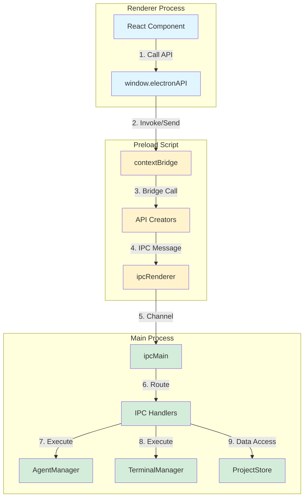
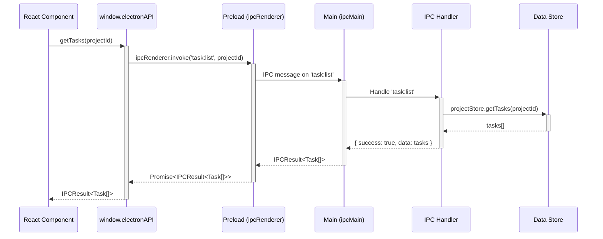
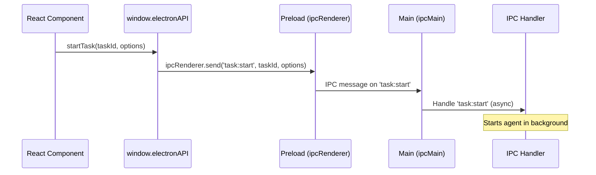
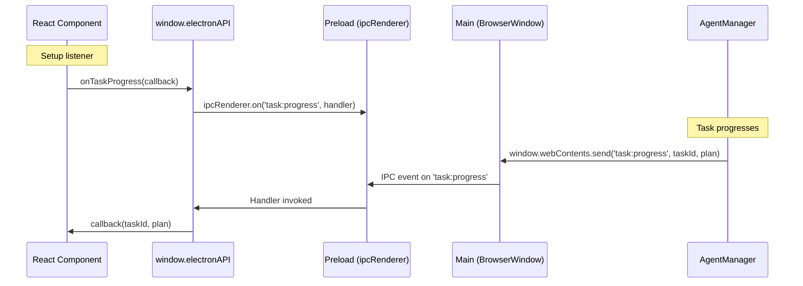

# Electron IPC Communication Patterns

This document describes the Inter-Process Communication (IPC) architecture in Auto Claude UI, including security patterns, communication flows, and implementation examples.

## Table of Contents

- [Overview](#overview)
- [Architecture](#architecture)
- [Communication Flow](#communication-flow)
- [Security Model](#security-model)
- [IPC Channels](#ipc-channels)
- [Handler Implementation](#handler-implementation)
- [Preload API](#preload-api)
- [Event Listeners](#event-listeners)
- [Best Practices](#best-practices)
- [Testing](#testing)

## Overview

Auto Claude UI uses Electron's IPC (Inter-Process Communication) to enable secure communication between:

- **Renderer Process** (React frontend) - Runs the UI
- **Main Process** (Node.js backend) - Has full system access
- **Preload Script** - Security bridge between renderer and main

The architecture follows Electron's security best practices with:
- Context isolation enabled
- Node integration disabled
- Controlled API surface via `contextBridge`

## Architecture



## Communication Flow

### Request-Response Pattern (invoke/handle)

Used for operations that need a response:



### Fire-and-Forget Pattern (send)

Used for operations that don't need a response:



### Event Stream Pattern (on/send)

Used for main process to push events to renderer:



## Security Model

### 1. Context Isolation

The renderer process cannot directly access Node.js or Electron APIs:

```typescript
// main/index.ts
webPreferences: {
  preload: join(__dirname, '../preload/index.js'),
  sandbox: false,              // Preload needs Node.js access
  contextIsolation: true,      // Isolate preload from renderer
  nodeIntegration: false,      // Disable Node.js in renderer
  backgroundThrottling: false  // Prevent terminal lag
}
```

### 2. Context Bridge

Only explicitly exposed APIs are available to the renderer:

```typescript
// preload/index.ts
import { contextBridge } from 'electron';
import { createElectronAPI } from './api';

// Create the unified API by combining all domain-specific APIs
const electronAPI = createElectronAPI();

// Expose to renderer via contextBridge
contextBridge.exposeInMainWorld('electronAPI', electronAPI);
```

**Key Security Principles:**

- ✅ **Whitelist approach** - Only explicitly exposed functions are accessible
- ✅ **No direct access** - Renderer cannot access `ipcRenderer`, `fs`, `child_process`, etc.
- ✅ **Immutable API** - Once exposed, the API cannot be modified by renderer
- ✅ **Type safety** - TypeScript ensures correct API usage

### 3. API Surface Control

APIs are organized by domain with clear boundaries:

```typescript
// preload/api/index.ts
export interface ElectronAPI extends
  ProjectAPI,      // Project operations
  TerminalAPI,     // Terminal operations
  TaskAPI,         // Task management
  SettingsAPI,     // App settings
  FileAPI,         // File operations
  AgentAPI,        // Claude profiles
  IdeationAPI,     // Ideation generation
  InsightsAPI,     // AI insights
  AppUpdateAPI {}  // App updates

export const createElectronAPI = (): ElectronAPI => ({
  ...createProjectAPI(),
  ...createTerminalAPI(),
  ...createTaskAPI(),
  ...createSettingsAPI(),
  ...createFileAPI(),
  ...createAgentAPI(),
  ...createIdeationAPI(),
  ...createInsightsAPI(),
  ...createAppUpdateAPI()
});
```

## IPC Channels

Channels follow a consistent naming convention:

```typescript
// shared/constants/ipc.ts
export const IPC_CHANNELS = {
  // Pattern: {domain}:{action}

  // Project operations
  PROJECT_ADD: 'project:add',
  PROJECT_REMOVE: 'project:remove',
  PROJECT_LIST: 'project:list',

  // Task operations
  TASK_CREATE: 'task:create',
  TASK_LIST: 'task:list',
  TASK_START: 'task:start',
  TASK_STOP: 'task:stop',

  // Task events (main -> renderer)
  TASK_PROGRESS: 'task:progress',
  TASK_ERROR: 'task:error',
  TASK_STATUS_CHANGE: 'task:statusChange',

  // Terminal operations
  TERMINAL_CREATE: 'terminal:create',
  TERMINAL_DESTROY: 'terminal:destroy',
  TERMINAL_INPUT: 'terminal:input',

  // Terminal events (main -> renderer)
  TERMINAL_OUTPUT: 'terminal:output',
  TERMINAL_EXIT: 'terminal:exit'
} as const;
```

**Naming Convention:**
- `{domain}:{action}` - Request from renderer (e.g., `task:create`)
- `{domain}:{event}` - Event from main (e.g., `task:progress`)
- Use lowercase with colons
- Be descriptive but concise

## Handler Implementation

### Main Process Handler Setup

Handlers are organized by domain in `main/ipc-handlers/`:

```typescript
// main/ipc-setup.ts
export function setupIpcHandlers(
  agentManager: AgentManager,
  terminalManager: TerminalManager,
  getMainWindow: () => BrowserWindow | null,
  pythonEnvManager: PythonEnvManager
): void {
  // Delegate to modular handler setup
  setupModularHandlers(agentManager, terminalManager, getMainWindow, pythonEnvManager);
}
```

```typescript
// main/ipc-handlers/task/index.ts
export function registerTaskHandlers(
  agentManager: AgentManager,
  pythonEnvManager: PythonEnvManager,
  getMainWindow: () => BrowserWindow | null
): void {
  // Register CRUD handlers (create, read, update, delete)
  registerTaskCRUDHandlers(agentManager);

  // Register execution handlers (start, stop, review, status, recovery)
  registerTaskExecutionHandlers(agentManager, getMainWindow);

  // Register worktree handlers (status, diff, merge, discard, list)
  registerWorktreeHandlers(pythonEnvManager, getMainWindow);

  // Register logs handlers (get, watch, unwatch)
  registerTaskLogsHandlers(getMainWindow);
}
```

### Request-Response Handler Example

```typescript
// main/ipc-handlers/task/crud-handlers.ts
import { ipcMain } from 'electron';
import { IPC_CHANNELS } from '../../../shared/constants';
import type { IPCResult, Task } from '../../../shared/types';

export function registerTaskCRUDHandlers(agentManager: AgentManager): void {
  /**
   * List all tasks for a project
   */
  ipcMain.handle(
    IPC_CHANNELS.TASK_LIST,
    async (_, projectId: string): Promise<IPCResult<Task[]>> => {
      console.warn('[IPC] TASK_LIST called with projectId:', projectId);
      const tasks = projectStore.getTasks(projectId);
      console.warn('[IPC] TASK_LIST returning', tasks.length, 'tasks');
      return { success: true, data: tasks };
    }
  );

  /**
   * Create a new task
   */
  ipcMain.handle(
    IPC_CHANNELS.TASK_CREATE,
    async (
      _,
      projectId: string,
      title: string,
      description: string,
      metadata?: TaskMetadata
    ): Promise<IPCResult<Task>> => {
      const project = projectStore.getProject(projectId);
      if (!project) {
        return { success: false, error: 'Project not found' };
      }

      // Generate unique spec ID
      const specId = generateSpecId(project, title);

      // Create task
      const task = projectStore.createTask(projectId, {
        id: specId,
        title,
        description,
        status: 'pending',
        metadata
      });

      return { success: true, data: task };
    }
  );
}
```

### Fire-and-Forget Handler Example

```typescript
// main/ipc-handlers/task/execution-handlers.ts
ipcMain.on(
  IPC_CHANNELS.TASK_START,
  (_, taskId: string, options?: TaskStartOptions) => {
    console.warn('[IPC] TASK_START called with taskId:', taskId);

    // Start agent in background (non-blocking)
    agentManager.startTask(taskId, options)
      .then(() => {
        console.warn('[IPC] Task started successfully');
      })
      .catch((error) => {
        console.error('[IPC] Task start failed:', error);
        // Send error event to renderer
        const mainWindow = getMainWindow();
        mainWindow?.webContents.send(
          IPC_CHANNELS.TASK_ERROR,
          taskId,
          error.message
        );
      });
  }
);
```

### Event Emission Example

```typescript
// main/agent/agent-manager.ts
export class AgentManager {
  private startTask(taskId: string): void {
    // ... task execution logic ...

    // Emit progress events to renderer
    const mainWindow = getMainWindow();

    mainWindow?.webContents.send(
      IPC_CHANNELS.TASK_STATUS_CHANGE,
      taskId,
      'running'
    );

    mainWindow?.webContents.send(
      IPC_CHANNELS.TASK_PROGRESS,
      taskId,
      implementationPlan
    );
  }
}
```

## Preload API

### API Creator Pattern

Each domain has its own API creator:

```typescript
// preload/api/task-api.ts
import { ipcRenderer } from 'electron';
import { IPC_CHANNELS } from '../../shared/constants';
import type { Task, IPCResult, TaskStartOptions } from '../../shared/types';

export interface TaskAPI {
  // Request-response operations
  getTasks: (projectId: string) => Promise<IPCResult<Task[]>>;
  createTask: (
    projectId: string,
    title: string,
    description: string,
    metadata?: TaskMetadata
  ) => Promise<IPCResult<Task>>;

  // Fire-and-forget operations
  startTask: (taskId: string, options?: TaskStartOptions) => void;
  stopTask: (taskId: string) => void;

  // Event listeners
  onTaskProgress: (callback: (taskId: string, plan: ImplementationPlan) => void) => () => void;
  onTaskError: (callback: (taskId: string, error: string) => void) => () => void;
}

export const createTaskAPI = (): TaskAPI => ({
  // Request-response: ipcRenderer.invoke returns a Promise
  getTasks: (projectId: string): Promise<IPCResult<Task[]>> =>
    ipcRenderer.invoke(IPC_CHANNELS.TASK_LIST, projectId),

  createTask: (
    projectId: string,
    title: string,
    description: string,
    metadata?: TaskMetadata
  ): Promise<IPCResult<Task>> =>
    ipcRenderer.invoke(IPC_CHANNELS.TASK_CREATE, projectId, title, description, metadata),

  // Fire-and-forget: ipcRenderer.send is void
  startTask: (taskId: string, options?: TaskStartOptions): void =>
    ipcRenderer.send(IPC_CHANNELS.TASK_START, taskId, options),

  stopTask: (taskId: string): void =>
    ipcRenderer.send(IPC_CHANNELS.TASK_STOP, taskId),

  // Event listeners: return cleanup function
  onTaskProgress: (
    callback: (taskId: string, plan: ImplementationPlan) => void
  ): (() => void) => {
    const handler = (
      _event: Electron.IpcRendererEvent,
      taskId: string,
      plan: ImplementationPlan
    ): void => {
      callback(taskId, plan);
    };
    ipcRenderer.on(IPC_CHANNELS.TASK_PROGRESS, handler);
    return () => {
      ipcRenderer.removeListener(IPC_CHANNELS.TASK_PROGRESS, handler);
    };
  },

  onTaskError: (
    callback: (taskId: string, error: string) => void
  ): (() => void) => {
    const handler = (
      _event: Electron.IpcRendererEvent,
      taskId: string,
      error: string
    ): void => {
      callback(taskId, error);
    };
    ipcRenderer.on(IPC_CHANNELS.TASK_ERROR, handler);
    return () => {
      ipcRenderer.removeListener(IPC_CHANNELS.TASK_ERROR, handler);
    };
  }
});
```

### Type Safety

The API surface is fully typed:

```typescript
// shared/types/ipc.ts
export interface ElectronAPI {
  // Project operations
  addProject: (projectPath: string) => Promise<IPCResult<Project>>;
  removeProject: (projectId: string) => Promise<IPCResult>;
  getProjects: () => Promise<IPCResult<Project[]>>;

  // Task operations
  getTasks: (projectId: string) => Promise<IPCResult<Task[]>>;
  createTask: (projectId: string, title: string, description: string) => Promise<IPCResult<Task>>;
  startTask: (taskId: string, options?: TaskStartOptions) => void;

  // Event listeners
  onTaskProgress: (callback: (taskId: string, plan: ImplementationPlan) => void) => () => void;
  onTaskError: (callback: (taskId: string, error: string) => void) => () => void;
}

declare global {
  interface Window {
    electronAPI: ElectronAPI;
    DEBUG: boolean;
  }
}
```

## Event Listeners

### Renderer-Side Usage

```typescript
// React component
import { useEffect, useState } from 'react';

function TaskMonitor({ taskId }: { taskId: string }) {
  const [progress, setProgress] = useState<ImplementationPlan | null>(null);
  const [error, setError] = useState<string | null>(null);

  useEffect(() => {
    // Setup listeners
    const unsubscribeProgress = window.electronAPI.onTaskProgress(
      (id, plan) => {
        if (id === taskId) {
          setProgress(plan);
        }
      }
    );

    const unsubscribeError = window.electronAPI.onTaskError(
      (id, errorMsg) => {
        if (id === taskId) {
          setError(errorMsg);
        }
      }
    );

    // Cleanup on unmount
    return () => {
      unsubscribeProgress();
      unsubscribeError();
    };
  }, [taskId]);

  return (
    <div>
      {error && <div className="error">{error}</div>}
      {progress && <ProgressDisplay plan={progress} />}
    </div>
  );
}
```

### Main Process Event Emission

```typescript
// main/agent/agent-manager.ts
export class AgentManager {
  private emitProgress(taskId: string, plan: ImplementationPlan): void {
    const mainWindow = this.getMainWindow();
    if (mainWindow) {
      mainWindow.webContents.send(
        IPC_CHANNELS.TASK_PROGRESS,
        taskId,
        plan
      );
    }
  }

  private emitError(taskId: string, error: string): void {
    const mainWindow = this.getMainWindow();
    if (mainWindow) {
      mainWindow.webContents.send(
        IPC_CHANNELS.TASK_ERROR,
        taskId,
        error
      );
    }
  }
}
```

## Best Practices

### 1. Error Handling

Always return structured error responses:

```typescript
// ✅ Good: Structured error response
ipcMain.handle('task:create', async (_, projectId, title) => {
  try {
    const task = await createTask(projectId, title);
    return { success: true, data: task };
  } catch (error) {
    return {
      success: false,
      error: error.message || 'Failed to create task'
    };
  }
});

// ❌ Bad: Throwing errors across IPC boundary
ipcMain.handle('task:create', async (_, projectId, title) => {
  // This will cause unhandled rejection in renderer
  const task = await createTask(projectId, title);
  return task;
});
```

### 2. Input Validation

Validate all inputs in the main process:

```typescript
ipcMain.handle('project:add', async (_, projectPath: string) => {
  // Validate input
  if (!projectPath || typeof projectPath !== 'string') {
    return { success: false, error: 'Invalid project path' };
  }

  if (!existsSync(projectPath)) {
    return { success: false, error: 'Project path does not exist' };
  }

  // Process valid input
  const project = await addProject(projectPath);
  return { success: true, data: project };
});
```

### 3. Channel Naming

Use consistent, descriptive channel names:

```typescript
// ✅ Good: Clear domain and action
'task:create'
'task:progress'
'terminal:output'

// ❌ Bad: Unclear or inconsistent
'createTask'
'taskProgress'
'term-output'
```

### 4. Type Definitions

Always define shared types:

```typescript
// shared/types/task.ts
export interface Task {
  id: string;
  title: string;
  description: string;
  status: TaskStatus;
  metadata?: TaskMetadata;
}

export type TaskStatus = 'pending' | 'running' | 'completed' | 'failed';

export interface IPCResult<T = void> {
  success: boolean;
  data?: T;
  error?: string;
}
```

### 5. Listener Cleanup

Always return cleanup functions from event listeners:

```typescript
// ✅ Good: Returns cleanup function
onTaskProgress: (callback) => {
  const handler = (_event, taskId, plan) => callback(taskId, plan);
  ipcRenderer.on(IPC_CHANNELS.TASK_PROGRESS, handler);
  return () => ipcRenderer.removeListener(IPC_CHANNELS.TASK_PROGRESS, handler);
};

// ❌ Bad: No cleanup mechanism
onTaskProgress: (callback) => {
  ipcRenderer.on(IPC_CHANNELS.TASK_PROGRESS, (_, taskId, plan) => {
    callback(taskId, plan);
  });
  // Listener never gets removed!
};
```

### 6. Logging

Add consistent logging for debugging:

```typescript
ipcMain.handle('task:create', async (_, projectId, title) => {
  console.warn('[IPC] TASK_CREATE called:', { projectId, title });

  try {
    const task = await createTask(projectId, title);
    console.warn('[IPC] TASK_CREATE success:', task.id);
    return { success: true, data: task };
  } catch (error) {
    console.error('[IPC] TASK_CREATE failed:', error);
    return { success: false, error: error.message };
  }
});
```

## Testing

### Integration Test Example

```typescript
// src/__tests__/integration/ipc-bridge.test.ts
import { describe, it, expect, vi, beforeEach } from 'vitest';

const mockIpcRenderer = {
  invoke: vi.fn(),
  send: vi.fn(),
  on: vi.fn(),
  removeListener: vi.fn()
};

vi.mock('electron', () => ({
  ipcRenderer: mockIpcRenderer,
  contextBridge: {
    exposeInMainWorld: vi.fn((name, api) => {
      exposedApis[name] = api;
    })
  }
}));

describe('IPC Bridge Integration', () => {
  let electronAPI: ElectronAPI;

  beforeEach(async () => {
    vi.clearAllMocks();
    await import('../../preload/index');
    electronAPI = exposedApis['electronAPI'];
  });

  it('should invoke project:add when addProject is called', async () => {
    mockIpcRenderer.invoke.mockResolvedValue({
      success: true,
      data: { id: '1' }
    });

    await electronAPI.addProject('/test/path');

    expect(mockIpcRenderer.invoke).toHaveBeenCalledWith(
      'project:add',
      '/test/path'
    );
  });

  it('should send task:start when startTask is called', () => {
    electronAPI.startTask('task-123', { resume: false });

    expect(mockIpcRenderer.send).toHaveBeenCalledWith(
      'task:start',
      'task-123',
      { resume: false }
    );
  });

  it('should register event listener for task:progress', () => {
    const callback = vi.fn();
    const unsubscribe = electronAPI.onTaskProgress(callback);

    expect(mockIpcRenderer.on).toHaveBeenCalledWith(
      'task:progress',
      expect.any(Function)
    );

    // Test cleanup
    unsubscribe();
    expect(mockIpcRenderer.removeListener).toHaveBeenCalledWith(
      'task:progress',
      expect.any(Function)
    );
  });
});
```

## Security Considerations

### 1. Never Expose Raw APIs

```typescript
// ❌ DANGEROUS: Exposing raw ipcRenderer
contextBridge.exposeInMainWorld('ipcRenderer', ipcRenderer);

// ✅ SAFE: Exposing controlled API
contextBridge.exposeInMainWorld('electronAPI', {
  getTasks: (projectId) => ipcRenderer.invoke('task:list', projectId)
});
```

### 2. Validate in Main Process

```typescript
// Never trust data from renderer - always validate
ipcMain.handle('file:read', async (_, filePath: string) => {
  // ✅ Validate path is within allowed directories
  const allowedDirs = [app.getPath('userData'), '/project/path'];
  const isAllowed = allowedDirs.some(dir => filePath.startsWith(dir));

  if (!isAllowed) {
    return { success: false, error: 'Access denied' };
  }

  // Safe to proceed
  const content = await fs.readFile(filePath, 'utf-8');
  return { success: true, data: content };
});
```

### 3. Sanitize Outputs

```typescript
// Don't leak sensitive information
ipcMain.handle('env:get', async () => {
  const env = {
    // ✅ Only expose what's needed
    NODE_ENV: process.env.NODE_ENV,
    DEBUG: process.env.DEBUG

    // ❌ Don't expose secrets
    // CLAUDE_API_KEY: process.env.CLAUDE_API_KEY
  };

  return { success: true, data: env };
});
```

### 4. Rate Limiting

```typescript
// Prevent abuse of expensive operations
const rateLimiter = new Map<string, number>();

ipcMain.handle('ai:generate', async (event, prompt) => {
  const now = Date.now();
  const lastCall = rateLimiter.get(event.sender.id) || 0;

  if (now - lastCall < 1000) { // 1 second cooldown
    return { success: false, error: 'Rate limit exceeded' };
  }

  rateLimiter.set(event.sender.id, now);

  // Process request
  const result = await generateWithAI(prompt);
  return { success: true, data: result };
});
```

## Summary

Auto Claude UI's IPC architecture provides:

- ✅ **Secure** - Context isolation with controlled API surface
- ✅ **Type-safe** - Full TypeScript coverage across processes
- ✅ **Modular** - Domain-organized handlers and APIs
- ✅ **Testable** - Clear boundaries for unit/integration tests
- ✅ **Scalable** - Easy to add new channels and handlers

For more details on specific domains:
- [Architecture Overview](./architecture.md)
- [Components](./components.md)
- [State Management](./state-management.md)
