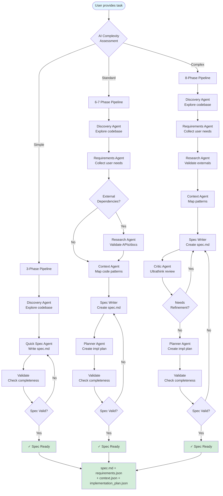
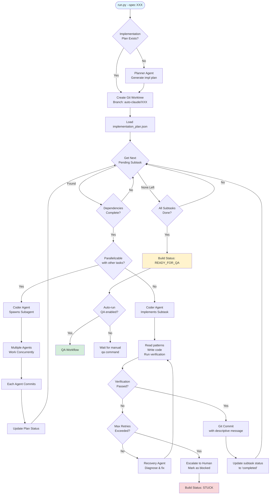
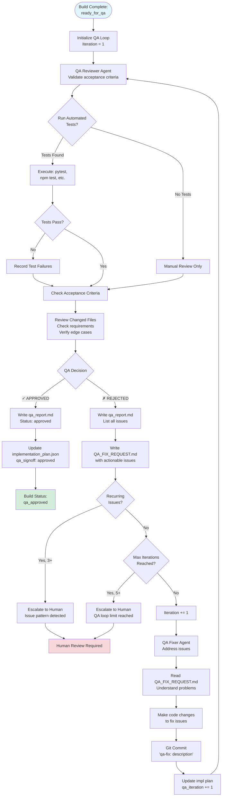
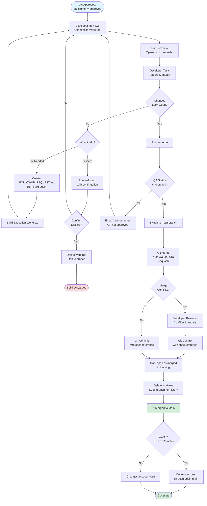
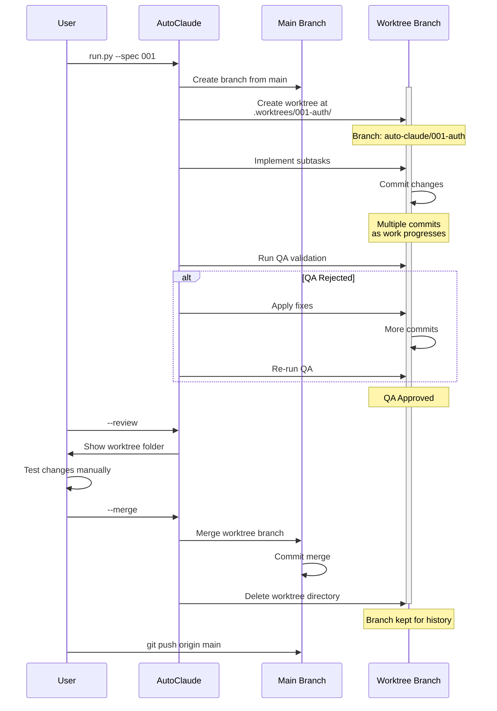

# Development Workflows

This document explains Auto Claude's development workflows from initial idea to production-ready code. Understanding these workflows is essential for contributing to the project and using Auto Claude effectively.

**Target Audience:** Developers who want to understand how Auto Claude orchestrates AI agents to build features autonomously.

---

## Table of Contents

1. [Overview](#overview)
2. [Spec Creation Workflow](#spec-creation-workflow)
3. [Build Execution Workflow](#build-execution-workflow)
4. [QA Validation Workflow](#qa-validation-workflow)
5. [Merge Workflow](#merge-workflow)
6. [Git Worktree Strategy](#git-worktree-strategy)
7. [Complete End-to-End Example](#complete-end-to-end-example)
8. [Troubleshooting](#troubleshooting)

---

## Overview

Auto Claude uses a **multi-stage pipeline** to transform a user's task description into production-ready code. Each stage is handled by specialized AI agents working in isolated environments.

### The Four Main Workflows

| Workflow | Purpose | Entry Point | Output |
|----------|---------|-------------|--------|
| **Spec Creation** | Convert user requirements into detailed specification | `spec_runner.py` | `spec.md`, `implementation_plan.json` |
| **Build Execution** | Implement the spec as working code | `run.py --spec XXX` | Code changes in worktree |
| **QA Validation** | Verify acceptance criteria are met | Automatic after build | `qa_report.md` with pass/fail |
| **Merge** | Integrate approved changes into main branch | `run.py --spec XXX --merge` | Changes merged to main |

### Key Principles

- **Isolation First** - All work happens in separate git worktrees, keeping `main` safe
- **Human in the Loop** - Critical decisions (spec approval, QA sign-off, merges) require human approval
- **Automatic Recovery** - Agents can resume from interruptions and retry failed tasks
- **Transparency** - All agent decisions and actions are logged in human-readable files

---

## Spec Creation Workflow

**Purpose:** Transform a task description into a detailed, actionable specification.

The spec creation workflow is **adaptive** - it uses AI to assess task complexity and adjusts the number of phases accordingly (3-8 phases).

### Complexity Tiers

Auto Claude evaluates task complexity using AI assessment or heuristics:

| Tier | Phases | When to Use | Example Tasks |
|------|--------|-------------|---------------|
| **SIMPLE** | 3 phases | 1-2 files, no research needed | "Fix button color", "Update text label" |
| **STANDARD** | 6 phases | 3-10 files, established patterns | "Add dark mode toggle", "Refactor auth flow" |
| **STANDARD + Research** | 7 phases | External dependencies to validate | "Integrate Stripe API", "Add Redis caching" |
| **COMPLEX** | 8 phases | 10+ files, infrastructure changes | "Build GraphQL API", "Add multi-tenant support" |

### Spec Creation Flowchart



### Phase Descriptions

#### Discovery Agent
**Purpose:** Understand the existing codebase structure and patterns.

**What it does:**
- Searches for relevant files using glob patterns
- Identifies existing implementations to reference
- Maps folder structure and key components
- Detects tech stack and frameworks in use

**Output:** `context.json` with codebase discoveries

#### Requirements Gatherer (Standard/Complex)
**Purpose:** Collect and structure user requirements.

**What it does:**
- Asks clarifying questions if task is ambiguous
- Documents functional and non-functional requirements
- Identifies edge cases and constraints
- Determines which services/files need changes

**Output:** `requirements.json` with structured requirements

#### Research Agent (if needed)
**Purpose:** Validate external dependencies and APIs.

**What it does:**
- Checks documentation for third-party libraries
- Validates API endpoints and schemas
- Identifies version compatibility issues
- Documents integration patterns

**Output:** Research findings in `context.json`

#### Context Agent
**Purpose:** Deep dive into relevant code patterns.

**What it does:**
- Reads files identified during discovery
- Extracts code patterns to follow
- Documents existing architectural decisions
- Identifies reusable utilities

**Output:** Enhanced `context.json` with code patterns

#### Spec Writer
**Purpose:** Create the formal specification document.

**What it does:**
- Synthesizes all gathered information
- Writes clear, actionable `spec.md`
- Defines acceptance criteria
- Documents files to create/modify
- Includes code examples and patterns

**Output:** `spec.md` with complete specification

#### Critic Agent (Complex only)
**Purpose:** Self-critique the specification for quality.

**What it does:**
- Reviews spec using "ultrathink" reasoning
- Checks for ambiguities and gaps
- Validates technical feasibility
- Suggests improvements

**Output:** Critique and refined `spec.md`

#### Planner Agent
**Purpose:** Break the spec into implementation subtasks.

**What it does:**
- Creates phase-based implementation plan
- Defines subtasks with clear dependencies
- Assigns verification steps to each subtask
- Estimates complexity per task

**Output:** `implementation_plan.json` with subtask breakdown

#### Validator
**Purpose:** Ensure spec is complete and ready for implementation.

**What it does:**
- Checks all required files exist
- Validates JSON structure
- Ensures acceptance criteria are testable
- Confirms implementation plan is actionable

**Output:** Validation report (pass/fail)

### Commands

```bash
# Interactive mode (recommended for first-time users)
python auto-claude/spec_runner.py --interactive

# One-line task description
python auto-claude/spec_runner.py --task "Add user authentication with JWT"

# Force complexity level (override AI assessment)
python auto-claude/spec_runner.py --task "Simple fix" --complexity simple

# Continue interrupted spec creation
python auto-claude/spec_runner.py --continue 001-feature

# Skip AI complexity assessment (use heuristics only)
python auto-claude/spec_runner.py --task "Add button" --no-ai-assessment
```

### Output Files

After spec creation, you'll have:

```
.auto-claude/specs/001-feature/
├── spec.md                      # Complete specification
├── requirements.json            # Structured requirements
├── context.json                 # Codebase discoveries
├── implementation_plan.json     # Subtask breakdown
└── memory/                      # Session insights (optional)
```

---

## Build Execution Workflow

**Purpose:** Implement the specification as working code in an isolated worktree.

The build workflow executes the implementation plan created during spec creation. It uses multiple specialized agents working sequentially or in parallel.

### Build Execution Flowchart



### Agent Roles in Build Execution

#### Planner Agent
**Purpose:** Create or update the implementation plan.

**When it runs:**
- First time building a spec (creates initial plan)
- When user adds follow-up work (`FOLLOWUP_REQUEST.md`)

**What it does:**
- Reads `spec.md` to understand requirements
- Breaks work into phases and subtasks
- Defines dependencies between subtasks
- Assigns verification steps
- Writes `implementation_plan.json`

**Key decisions:**
- How to organize work into logical phases
- Which subtasks can run in parallel
- What verification proves each task is complete

#### Coder Agent
**Purpose:** Implement individual subtasks following patterns.

**When it runs:**
- For each pending subtask in the implementation plan
- When a subtask has all dependencies completed

**What it does:**
1. Reads pattern files to understand code style
2. Reads files to modify to understand current state
3. Implements the subtask (create/edit files)
4. Runs verification (tests, linters, build checks)
5. Commits changes with descriptive message
6. Updates implementation plan status

**Key decisions:**
- When to spawn subagents for parallel work
- How to break down complex subtasks
- When to use recovery mode vs. escalating to human

**Parallel Execution:**
The Coder Agent can spawn **subagents** to work on multiple independent subtasks simultaneously. This happens when:
- Multiple subtasks have no dependencies between them
- Subtasks touch different files (no merge conflicts)
- Agent determines parallel work is more efficient

#### Recovery Agent
**Purpose:** Diagnose and fix failed subtasks.

**When it runs:**
- When a subtask's verification fails
- Before hitting max retry limit (prevents escalation)

**What it does:**
- Analyzes error messages and logs
- Reads recent code changes
- Identifies root cause (logic error, missing import, etc.)
- Applies fix and re-runs verification
- Updates build progress with diagnosis

**Escalation:**
If recovery fails 3 times, the agent:
1. Marks subtask as **blocked**
2. Documents the issue in `build-progress.txt`
3. Sets build status to **STUCK**
4. Waits for human intervention

### Build States

The build progresses through these states:

| State | Meaning | What's Next |
|-------|---------|-------------|
| `in_progress` | Actively implementing subtasks | Continues until all subtasks complete |
| `ready_for_qa` | All subtasks done, awaiting validation | Run QA workflow (auto or manual) |
| `qa_in_progress` | QA reviewer is validating | Wait for QA result |
| `qa_rejected` | QA found issues | QA fixer addresses issues |
| `qa_approved` | Passed all acceptance criteria | Ready to merge |
| `stuck` | Agent blocked on a subtask | Human intervention required |

### Commands

```bash
# Start or resume a build
python auto-claude/run.py --spec 001

# List all specs and their status
python auto-claude/run.py --list

# View changes without merging (opens worktree in file browser)
python auto-claude/run.py --spec 001 --review

# Add follow-up work to a completed spec
# 1. Create .auto-claude/specs/001/FOLLOWUP_REQUEST.md with new task
# 2. Run the build again
python auto-claude/run.py --spec 001
```

### Build Output

During execution, you'll see:

```
.auto-claude/specs/001-feature/
├── implementation_plan.json     # Updated with subtask status
├── build-progress.txt           # Human-readable progress log
├── memory/                      # Session discoveries (optional)
│   ├── codebase_map.json
│   ├── patterns.json
│   └── gotchas.json
└── qa_report.md                 # Created after QA runs

.worktrees/001-feature/          # Isolated workspace
└── (your project files with changes)
```

---

## QA Validation Workflow

**Purpose:** Automatically validate that acceptance criteria are met before merging.

The QA workflow uses two agents in a loop:
1. **QA Reviewer** - Validates against acceptance criteria
2. **QA Fixer** - Addresses issues found by reviewer

### QA Validation Flowchart



### QA Reviewer Agent

**Purpose:** Validate the build meets all acceptance criteria.

**What it does:**

1. **Run Automated Tests** (if available)
   ```bash
   # Python projects
   pytest tests/ -v

   # JavaScript/TypeScript projects
   npm test

   # Mixed projects
   # Runs tests for all detected frameworks
   ```

2. **Manual Code Review**
   - Reads all changed files
   - Checks against acceptance criteria from `spec.md`
   - Verifies edge cases are handled
   - Looks for security issues or bugs
   - Checks code quality and patterns

3. **Make Decision**
   - **APPROVED** - All criteria met, tests pass, no issues
   - **REJECTED** - Issues found, creates detailed fix request

**Output:** `qa_report.md` with findings and decision

### QA Fixer Agent

**Purpose:** Address issues identified by QA Reviewer.

**What it does:**

1. Reads `QA_FIX_REQUEST.md` to understand issues
2. For each issue:
   - Locates the problematic code
   - Applies appropriate fix
   - Verifies the fix works
3. Commits changes with `qa-fix:` prefix
4. Triggers another QA review cycle

**Iteration Tracking:**
Each fix cycle increments the QA iteration counter. After 5 iterations, the system escalates to human review to prevent infinite loops.

### Recurring Issue Detection

If the same issue appears **3+ times** across iterations, Auto Claude:
1. Flags it as a **recurring issue**
2. Stops the QA loop
3. Creates a detailed summary in `qa_report.md`
4. Escalates to human review

**How it detects recurring issues:**
- Normalizes issue descriptions (removes line numbers, paths)
- Calculates similarity scores between issues
- Tracks issue history across iterations

### QA Without Tests

For projects without automated tests, QA Reviewer:
1. Performs manual code review only
2. Creates a **manual test plan** in `qa_report.md`
3. Documents steps for human verification
4. Can still approve/reject based on code review

### Commands

```bash
# Run QA manually (usually automatic after build)
python auto-claude/run.py --spec 001 --qa

# Check QA status
python auto-claude/run.py --spec 001 --qa-status

# View QA report
cat .auto-claude/specs/001-feature/qa_report.md
```

### QA Output Files

```
.auto-claude/specs/001-feature/
├── qa_report.md                 # Latest QA findings
├── QA_FIX_REQUEST.md           # Issues to fix (if rejected)
└── implementation_plan.json     # Updated with QA status
    └── qa_signoff:
        ├── status: "approved" | "rejected" | "in_progress"
        ├── iteration: 3
        └── recurring_issues: []
```

---

## Merge Workflow

**Purpose:** Integrate approved changes from the worktree back into your main branch.

After QA approval, you review the changes and decide whether to merge them into your project.

### Merge Workflow Flowchart



### Review Changes

Before merging, always review what was built:

```bash
# Open worktree folder to browse changes
python auto-claude/run.py --spec 001 --review

# View git diff from command line
cd .worktrees/001-feature
git diff main..auto-claude/001-feature

# View commit history
git log main..auto-claude/001-feature --oneline
```

### Merge Commands

```bash
# Merge approved changes to main
python auto-claude/run.py --spec 001 --merge

# If you have conflicts, resolve them and finish:
git add .
git commit -m "Merge spec 001-feature into main"

# Push to remote (manual step)
git push origin main
```

### Merge Safety

Auto Claude prevents unsafe merges:

1. **QA Check** - Must have `qa_signoff.status = "approved"`
2. **No Force Merges** - Conflicts require manual resolution
3. **Human Control** - Merge and push are always manual commands
4. **Branch Preservation** - Original branch kept for history

### Discard Changes

If you decide not to use the changes:

```bash
# Discard entire build (requires confirmation)
python auto-claude/run.py --spec 001 --discard

# Confirmation prompt
Are you sure you want to discard spec '001-feature'?
This will delete the worktree and branch. [y/N]: y

✓ Worktree deleted
✓ Branch auto-claude/001-feature deleted
✓ Spec marked as discarded
```

**Warning:** Discard is permanent. The code is deleted and cannot be recovered unless you backed it up.

### Post-Merge Cleanup

After merging, Auto Claude:
1. Removes the worktree directory (`.worktrees/001-feature/`)
2. Keeps the branch `auto-claude/001-feature` for history
3. Updates spec metadata with merge timestamp
4. Cleans up status files

You can manually delete the branch later:
```bash
git branch -d auto-claude/001-feature
```

---

## Git Worktree Strategy

**Purpose:** Isolate each feature's development in a separate workspace to prevent interference with your main codebase.

### What are Git Worktrees?

**Git worktrees** allow you to check out multiple branches simultaneously in different directories. Think of it as having multiple copies of your repository, each on a different branch, without cloning multiple times.

**Key Benefits:**
- Work on multiple features in parallel
- Main branch stays clean during development
- No need to stash/commit before switching contexts
- Each worktree has its own working directory

### Auto Claude's Worktree Architecture

```
your-project/
├── .git/                          # Main git repository
├── src/                           # Your main branch files
├── package.json
├── README.md
│
├── .worktrees/                    # Worktree root (gitignored)
│   ├── 001-auth/                  # Spec 001 workspace
│   │   ├── src/                   # Branch: auto-claude/001-auth
│   │   ├── package.json
│   │   └── (all project files)
│   │
│   ├── 002-ui-redesign/           # Spec 002 workspace
│   │   ├── src/                   # Branch: auto-claude/002-ui-redesign
│   │   └── (all project files)
│   │
│   └── 003-api/                   # Spec 003 workspace
│       └── (all project files)    # Branch: auto-claude/003-api
│
└── .auto-claude/
    └── specs/
        ├── 001-auth/
        ├── 002-ui-redesign/
        └── 003-api/
```

### Branch Naming Convention

**Pattern:** `auto-claude/{spec-name}`

Examples:
- `auto-claude/001-authentication`
- `auto-claude/002-dark-mode`
- `auto-claude/003-api-refactor`

This convention:
- Makes it clear which branches are AI-generated
- Groups all Auto Claude work under one namespace
- Prevents naming conflicts with human-created branches

### Worktree Lifecycle



### Worktree Isolation Benefits

1. **Safety** - Main branch is never touched until you explicitly merge
2. **Parallelism** - Multiple AI agents can work on different specs simultaneously
3. **Rollback** - Easy to discard changes without affecting main
4. **Review** - Inspect complete feature before integration
5. **Testing** - Test in isolation without side effects

### Commands

```bash
# List all worktrees
git worktree list

# Output:
# /path/to/project                    abc123 [main]
# /path/to/project/.worktrees/001-auth  def456 [auto-claude/001-auth]

# Manually navigate to a worktree
cd .worktrees/001-auth

# View worktree status
git status

# View commits in worktree branch
git log main..auto-claude/001-auth --oneline
```

### Troubleshooting Worktrees

#### Issue: "Worktree already exists"

**Cause:** Previous build was interrupted

**Solution:**
```bash
# Resume the existing build
python auto-claude/run.py --spec 001

# Or remove the worktree first
git worktree remove .worktrees/001-auth --force
python auto-claude/run.py --spec 001
```

#### Issue: "Branch already exists"

**Cause:** Branch wasn't cleaned up from previous build

**Solution:**
```bash
# Delete the branch
git branch -D auto-claude/001-auth

# Or use a different spec name
python auto-claude/spec_runner.py --task "..." # Creates new spec number
```

#### Issue: Can't switch to main while in worktree

**Cause:** You're inside a worktree directory

**Solution:**
```bash
# Navigate back to main project directory
cd /path/to/your-project

# Now you can use git normally
git status
git checkout main
```

---

## Complete End-to-End Example

Let's walk through building a complete feature from idea to production.

### Scenario: Add Dark Mode Toggle

**Goal:** Add a dark mode toggle to the application settings page.

### Step 1: Create Spec (2-5 minutes)

```bash
$ python auto-claude/spec_runner.py --task "Add dark mode toggle to settings page"

🔍 Assessing complexity...
✓ Complexity: STANDARD (6 phases)

🚀 Starting spec creation...

Phase 1/6: Discovery
├─ Exploring codebase structure...
├─ Found: src/components/Settings.tsx
├─ Found: src/stores/themeStore.ts
└─ ✓ Discovery complete

Phase 2/6: Requirements
├─ Analyzing task requirements...
└─ ✓ Requirements documented

Phase 3/6: Context
├─ Reading pattern files...
├─ Found existing theme system
└─ ✓ Context mapped

Phase 4/6: Spec Writing
├─ Creating spec.md...
└─ ✓ Spec written

Phase 5/6: Planning
├─ Breaking into subtasks...
├─ Phase 1: UI Components (2 subtasks)
├─ Phase 2: State Management (1 subtask)
├─ Phase 3: Styling (2 subtasks)
└─ ✓ Plan created

Phase 6/6: Validation
└─ ✓ Spec validated

✓ Spec created: 005-dark-mode-toggle
```

**What was created:**
```
.auto-claude/specs/005-dark-mode-toggle/
├── spec.md                      # Complete specification
├── requirements.json            # Structured requirements
├── context.json                 # Codebase patterns
└── implementation_plan.json     # 5 subtasks across 3 phases
```

### Step 2: Review Spec (optional)

```bash
$ cat .auto-claude/specs/005-dark-mode-toggle/spec.md

# Specification: Dark Mode Toggle

## Overview
Add a dark mode toggle switch to the settings page that persists user preference...

## Acceptance Criteria
1. Toggle switch visible in settings page
2. Clicking toggle switches theme immediately
3. Preference persists across sessions
4. All components support dark mode styles
...
```

### Step 3: Run Build (10-30 minutes depending on complexity)

```bash
$ python auto-claude/run.py --spec 005

🔧 BUILD SESSION

Spec: 005-dark-mode-toggle
Status: in_progress

Creating worktree at .worktrees/005-dark-mode-toggle...
Branch: auto-claude/005-dark-mode-toggle

═══════════════════════════════════════════════════════
           PLANNER SESSION
═══════════════════════════════════════════════════════

Loading implementation plan...
✓ Plan has 5 subtasks across 3 phases

═══════════════════════════════════════════════════════
           CODER SESSION 1/5
═══════════════════════════════════════════════════════

Subtask: Create ToggleSwitch component
Phase: UI Components

Implementing...
├─ Reading pattern files...
├─ Creating src/components/ToggleSwitch.tsx...
├─ Adding Radix UI Switch...
└─ ✓ Component created

Running verification...
├─ npm run lint... ✓
├─ npm run type-check... ✓
└─ ✓ Verification passed

Committing...
└─ auto-claude: subtask-1-1 - Create ToggleSwitch component

═══════════════════════════════════════════════════════
           CODER SESSION 2/5
═══════════════════════════════════════════════════════

Subtask: Add toggle to Settings page
Phase: UI Components

Implementing...
├─ Reading src/components/Settings.tsx...
├─ Adding ToggleSwitch import...
├─ Inserting toggle in UI...
└─ ✓ Settings updated

Running verification...
└─ ✓ Verification passed

Committing...
└─ auto-claude: subtask-1-2 - Add toggle to Settings page

... [continues for remaining subtasks] ...

✓ All subtasks complete (5/5)
Build status: ready_for_qa

═══════════════════════════════════════════════════════
           QA REVIEWER SESSION
═══════════════════════════════════════════════════════

Running automated tests...
├─ npm test... ✓ 24 tests passed
└─ ✓ Tests passed

Validating acceptance criteria...
├─ Toggle switch visible in settings page... ✓
├─ Clicking toggle switches theme... ✓
├─ Preference persists across sessions... ✓
├─ All components support dark mode... ✓
└─ ✓ All criteria met

Decision: ✓ APPROVED

Build status: qa_approved
```

**What was created:**
```
.worktrees/005-dark-mode-toggle/     # Isolated workspace
├── src/
│   ├── components/
│   │   ├── ToggleSwitch.tsx        # New component
│   │   └── Settings.tsx            # Modified
│   └── stores/
│       └── themeStore.ts           # Modified

.auto-claude/specs/005-dark-mode-toggle/
├── implementation_plan.json        # All subtasks: completed
├── qa_report.md                    # QA approval
└── build-progress.txt              # Session log
```

### Step 4: Review Changes

```bash
$ python auto-claude/run.py --spec 005 --review

Opening .worktrees/005-dark-mode-toggle/ in file browser...
```

**Manual testing:**
1. Open the worktree in your IDE
2. Run `npm run dev` from the worktree
3. Navigate to settings page
4. Test the dark mode toggle
5. Verify persistence (refresh page)

### Step 5: Merge to Main

```bash
$ python auto-claude/run.py --spec 005 --merge

Merging spec 005-dark-mode-toggle into main...

Switching to main branch...
Merging auto-claude/005-dark-mode-toggle...
✓ Merge successful (no conflicts)

Committing merge...
└─ Merge spec 005-dark-mode-toggle: Add dark mode toggle to settings page

Cleaning up worktree...
✓ Worktree removed
✓ Branch kept for history

✓ Merge complete!

Next steps:
  git push origin main  # Push to remote
  git branch -d auto-claude/005-dark-mode-toggle  # Delete branch (optional)
```

### Step 6: Push to Remote (manual)

```bash
$ git push origin main

Enumerating objects: 12, done.
Counting objects: 100% (12/12), done.
Delta compression using up to 8 threads
Compressing objects: 100% (8/8), done.
Writing objects: 100% (8/8), 1.23 KiB | 1.23 MiB/s, done.
Total 8 (delta 6), reused 0 (delta 0), pack-reused 0
To github.com:your-username/your-project.git
   abc1234..def5678  main -> main

✓ Pushed to remote
```

**What happened:**
1. Spec created in 6 phases (2-5 min)
2. Build executed 5 subtasks (10-15 min)
3. QA validated automatically (1-2 min)
4. Human reviewed changes (5 min)
5. Merged to main and pushed (1 min)

**Total time:** ~20-30 minutes for a feature that might take 2-3 hours manually.

---

## Troubleshooting

### Build Issues

#### Build gets stuck on a subtask

**Symptoms:**
```
Coder Agent implementing subtask 3/10...
Verification failed: Tests not passing
Retrying (attempt 2/3)...
Verification failed: Tests not passing
Retrying (attempt 3/3)...
Verification failed: Tests not passing
⚠ Escalating to human review
Build status: STUCK
```

**Solutions:**

1. **Review the error:**
   ```bash
   cat .auto-claude/specs/XXX/build-progress.txt
   # Look for error messages and diagnosis
   ```

2. **Fix the issue manually:**
   ```bash
   cd .worktrees/XXX-feature
   # Fix the code
   git add .
   git commit -m "Manual fix: description"
   ```

3. **Resume the build:**
   ```bash
   python auto-claude/run.py --spec XXX
   # Build will continue from next subtask
   ```

4. **Or add follow-up work:**
   ```bash
   # Create .auto-claude/specs/XXX/FOLLOWUP_REQUEST.md
   echo "Fix the test failures in test_feature.py" > .auto-claude/specs/XXX/FOLLOWUP_REQUEST.md
   python auto-claude/run.py --spec XXX
   ```

#### Merge conflicts after merge

**Symptoms:**
```
$ python auto-claude/run.py --spec 005 --merge

Merging auto-claude/005-feature...
✗ Merge conflict in src/components/App.tsx
Please resolve conflicts manually.
```

**Solution:**

```bash
# Resolve conflicts in your editor
vim src/components/App.tsx

# Stage resolved files
git add src/components/App.tsx

# Complete the merge
git commit -m "Merge spec 005-feature into main"

# Build will automatically detect merge is complete
```

### QA Issues

#### QA loop keeps rejecting (5+ iterations)

**Symptoms:**
```
QA Iteration 5/5
Status: REJECTED

Issues found:
- Test failures in test_auth.py
- Same issue as iteration 3

⚠ Max iterations reached. Escalating to human review.
```

**Solutions:**

1. **Review recurring issues:**
   ```bash
   cat .auto-claude/specs/XXX/qa_report.md
   # Look for "Recurring Issues" section
   ```

2. **Fix manually:**
   ```bash
   cd .worktrees/XXX-feature
   # Fix the recurring issue
   git add .
   git commit -m "Manual fix: resolve recurring test failure"
   ```

3. **Re-run QA:**
   ```bash
   python auto-claude/run.py --spec XXX --qa
   ```

### Worktree Issues

#### Cannot remove worktree

**Symptoms:**
```
$ git worktree remove .worktrees/005-feature
fatal: '.worktrees/005-feature' contains modified or untracked files
```

**Solution:**

```bash
# Force remove (loses changes)
git worktree remove .worktrees/005-feature --force

# Or commit/stash changes first
cd .worktrees/005-feature
git add .
git commit -m "Save work"
cd ../..
git worktree remove .worktrees/005-feature
```

#### Worktree out of sync with branch

**Symptoms:**
- Changes in worktree don't match branch commits
- Git shows unexpected diffs

**Solution:**

```bash
# Reset worktree to match branch
cd .worktrees/XXX-feature
git reset --hard auto-claude/XXX-feature

# Or re-create the worktree
cd ../../
git worktree remove .worktrees/XXX-feature --force
git worktree add .worktrees/XXX-feature auto-claude/XXX-feature
```

### Spec Creation Issues

#### Complexity assessment seems wrong

**Symptoms:**
- Simple task gets complex 8-phase pipeline
- Complex task gets simple 3-phase pipeline

**Solution:**

```bash
# Force complexity level
python auto-claude/spec_runner.py \
  --task "Your task" \
  --complexity simple   # or: standard, complex

# Skip AI assessment (use heuristics only)
python auto-claude/spec_runner.py \
  --task "Your task" \
  --no-ai-assessment
```

#### Spec creation fails mid-phase

**Symptoms:**
```
Phase 3/6: Context
├─ Reading pattern files...
✗ Error: Claude API timeout

Spec status: incomplete
```

**Solution:**

```bash
# Continue from where it left off
python auto-claude/spec_runner.py --continue XXX-feature

# Or start over
rm -rf .auto-claude/specs/XXX-feature
python auto-claude/spec_runner.py --task "Your task"
```

---

## Additional Resources

- **[Backend Architecture](./backend/architecture.md)** - Deep dive into agent orchestration
- **[Agent System](./backend/agents.md)** - Detailed agent documentation
- **[Security Model](./backend/security.md)** - How isolation and sandboxing work
- **[Testing Guide](./testing.md)** - Testing strategies and best practices
- **[CLAUDE.md](../CLAUDE.md)** - Quick reference for commands

---

**Next Steps:**
1. Try creating your first spec with `python auto-claude/spec_runner.py --interactive`
2. Review the [Backend Architecture](./backend/architecture.md) to understand the agent system
3. Explore [Testing Guide](./testing.md) to learn about QA validation

---

**Need help?** Join our [Discord community](https://discord.gg/KCXaPBr4Dj) or open an issue on [GitHub](https://github.com/AndyMik90/Auto-Claude/issues).
